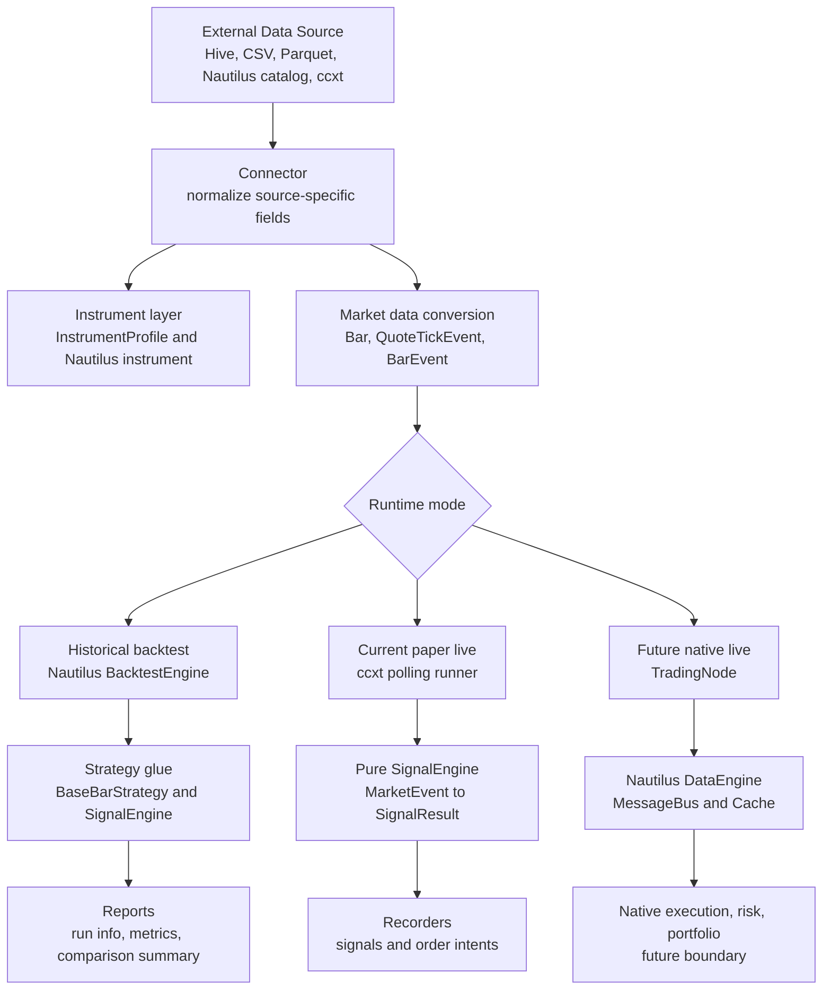
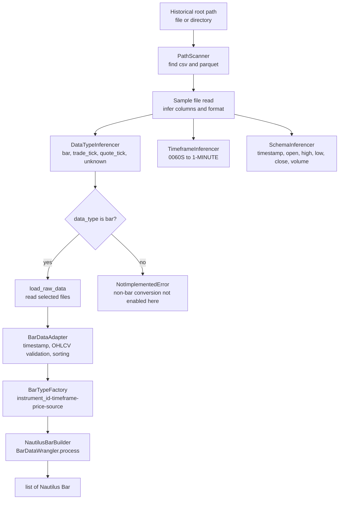
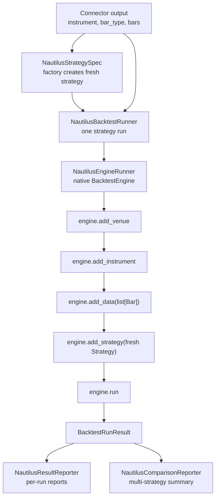
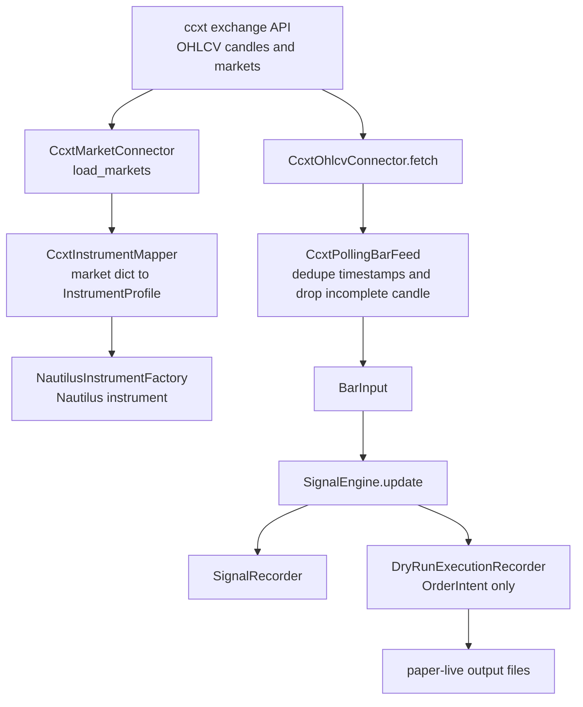
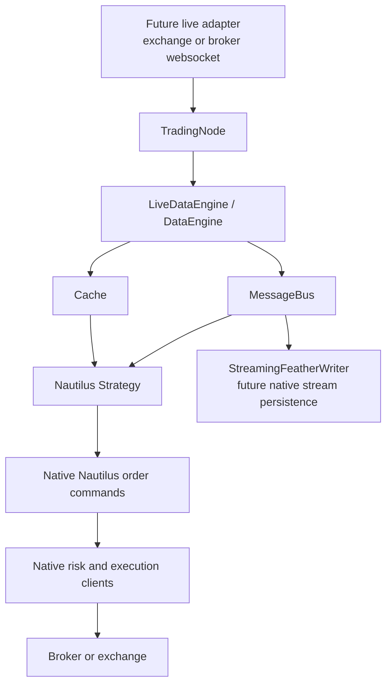
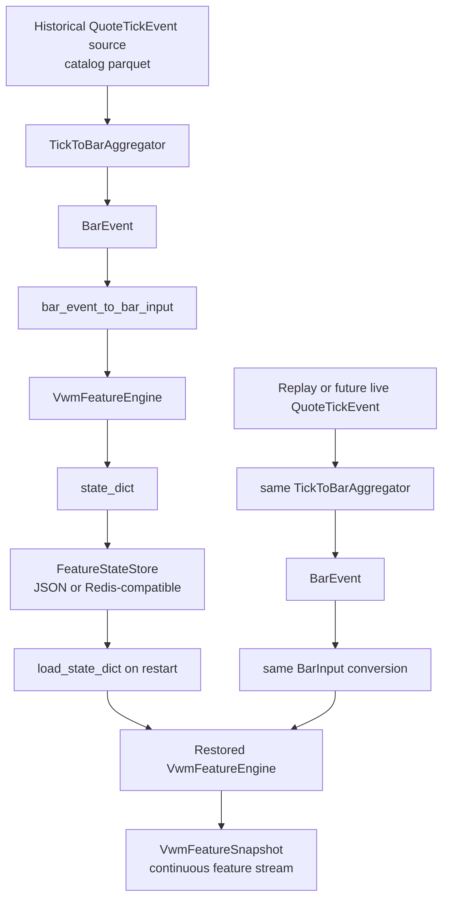
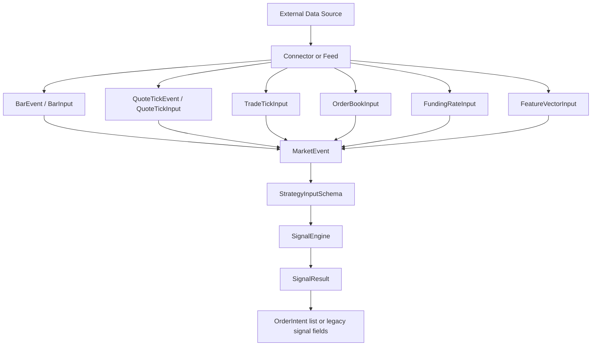
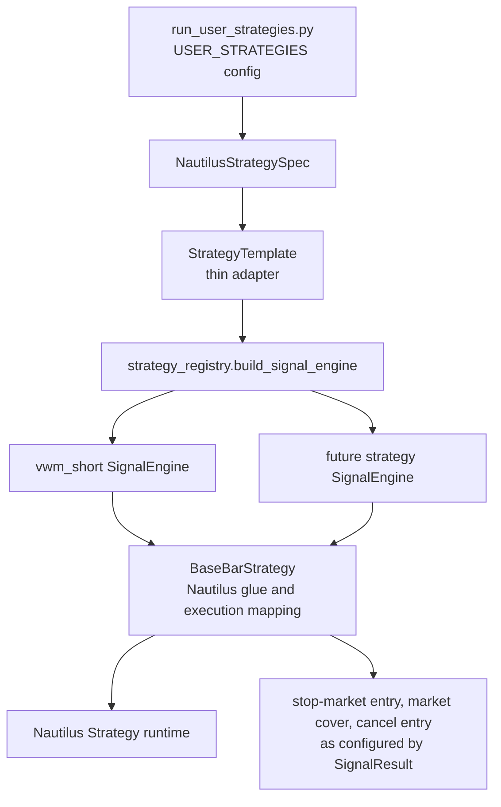
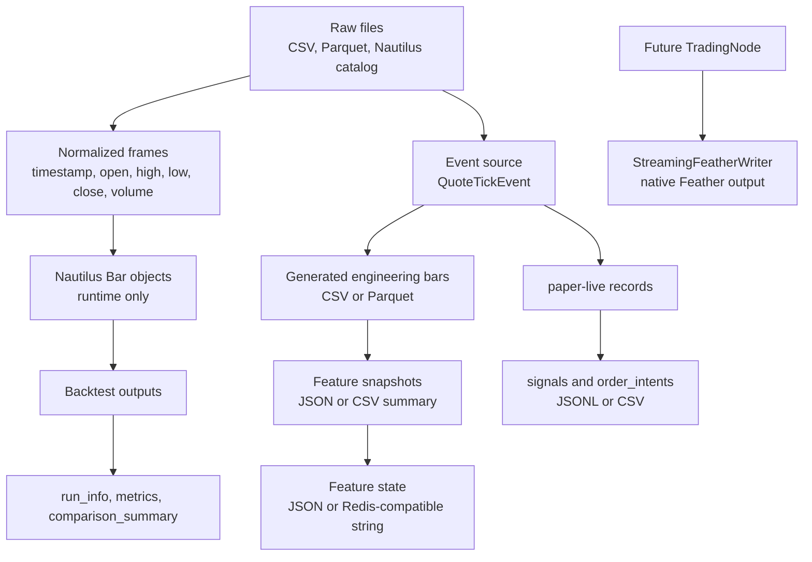
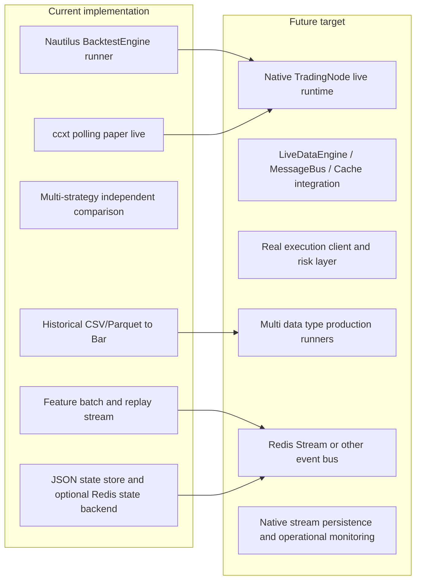

# nautilus_ext 数据流架构文档（Feature Data Layer 专项）

> 版本：2026-06  
> 覆盖模块：`nautilus_ext/ccxt/`、`nautilus_ext/ccxt_live/`、`nautilus_ext/features/`、`nautilus_ext/ml/`  
> 前置文档：[整体系统架构原版文档](#table-of-contents)（保留于下方）

---

## Feature Data Layer 架构文档

### 第 1 节：系统整体架构

nautilus_ext 由三个核心子系统构成，共同形成从原始市场数据到交易决策的完整流水线。

```
┌─────────────────────────────────────────────────────────────────────┐
│                       nautilus_ext 系统架构                          │
└─────────────────────────────────────────────────────────────────────┘

  ┌──────────────────┐
  │  ccxt REST API   │   (Binance / OKX / ...)
  └────────┬─────────┘
           │ fetch_ohlcv()
           ▼
  ┌──────────────────────────────────────────────────────────────────┐
  │                   ccxt 数据采集层                                  │
  │  CcxtOhlcvConnector  /  CcxtPollingBarFeed                       │
  │  输出：pd.DataFrame (原始 OHLCV) 或 list[Bar]                     │
  └──────────────────────────┬───────────────────────────────────────┘
                             │ BarInput (frozen dataclass)
                             ▼
  ┌──────────────────────────────────────────────────────────────────┐
  │              Feature Data Layer  (新增，重点模块)                  │
  │  FeaturePipeline → FeatureEngine × N → FeatureEvent              │
  │  OnlineFeatureStore (ring buffer) / OfflineFeatureStore (Parquet) │
  └──────────┬──────────────────────────────┬───────────────────────┘
             │ FeatureEvent                  │ 离线 Parquet
             ▼                              ▼
  ┌───────────────────────┐     ┌────────────────────────┐
  │   SignalEngine        │     │  Training Dataset       │
  │   update(bar, ctx)    │     │  load_feature_dataset() │
  │   → SignalResult      │     │  → pd.DataFrame         │
  └──────────┬────────────┘     └────────────────────────┘
             │ SignalResult / OrderIntent
             ▼
  ┌──────────────────────────────────────────────────────────────────┐
  │               输出层                                              │
  │  SignalRecorder → signals.csv / signals.parquet                  │
  │  DryRunExecutionRecorder → orders.csv                            │
  │  run_info.json                                                   │
  └──────────────────────────────────────────────────────────────────┘
```

---

### 第 2 节：Feature Data Layer 架构

Feature Data Layer 是本次新增的核心模块，负责将特征计算从信号引擎中剥离，形成独立的、可版本化、可持久化的数据资产。

```
                MarketEvent (BarInput / TradeTickInput / ...)
                      |
              FeaturePipeline._process_event(event)
              /            |              \
    Engine1            Engine2           Engine3
    .update(event)     .update(event)    .update(event)
    → FeatureEvent     → None            → FeatureEvent
    (BarInput only)    (不支持此类型)     (BarInput only)
                            |
                    [批量返回 list[FeatureEvent]]
                   /                          \
        OnlineFeatureStore              OfflineFeatureStore
        (内存 ring buffer)               (Parquet 批量写入)
        deque[FeatureEvent]              list[FeatureEvent]._buffer
        maxlen=500 per key               threshold=1000 auto-flush
               |                                  |
        get_latest(instrument_id,          flush() → Parquet
                   feature_set_id)         groupby(instrument, feature_set)
               |                                  |
       SignalEngine                      Training Dataset
       InferenceContext                  load_feature_dataset()
```

**核心数据类型一览：**

| 类型 | 文件 | 说明 |
|------|------|------|
| `BarInput` | `strategies/interfaces/input_types.py` | 输入市场事件（frozen dataclass） |
| `FeatureEvent` | `features/feature_event.py` | 输出特征快照（frozen dataclass，一 bar 一对象） |
| `FeatureSetSpec` | `features/feature_schema.py` | 特征集 schema 定义，含版本号 |
| `FeatureEngineBase` | `features/feature_engine.py` | 所有引擎的抽象基类 |
| `FeaturePipeline` | `features/feature_pipeline.py` | 多引擎编排器 |
| `OnlineFeatureStore` | `features/feature_store.py` | 低延迟内存存储 |
| `OfflineFeatureStore` | `features/feature_store.py` | 批量 Parquet 持久化 |

---

### 第 3 节：Online 低延迟路径

**核心设计原则：online 热路径上不创建任何 DataFrame。** 每个 market event 对应一个轻量 Python 对象，直接在 deque 中追加，时间复杂度为 O(1)。

#### 正确路径（当前实现）

```
BarInput object  (frozen dataclass, ~200 bytes)
  ↓  engine.update(event)          — 无 DataFrame
FeatureEngineBase.update(event)
  ↓  计算 VWM / ATR / Momentum     — 无 DataFrame
FeatureEvent object  (frozen dataclass)
  ↓  online_store.put(event)       — deque.append(), O(1)
OnlineFeatureStore._buffers[key]   — deque(maxlen=500)
  ↓  offline_store.append(event)   — list.append(), O(1)
OfflineFeatureStore._buffer        — list[FeatureEvent], 触发阈值前不写盘
  ↓  signal_engine.update(bar, context)
SignalResult object
  ↓  recorder._rows.append(row_dict)
SignalRecorder._rows               — list[dict], 会话结束时批量转 DataFrame
```

#### 错误模式（需避免）

```
BAD: MarketEvent → dict → DataFrame(1行) → row → dict → FeatureEvent
                → DataFrame(1行) → Strategy

问题：
  - 每 bar 创建 1~2 个 DataFrame，GC 压力极大
  - 内存碎片化，热路径上的 Python 对象分配剧增
  - 在 1-min bar + 10 instruments 场景下，每分钟产生 20 个临时 DataFrame
```

#### 内存布局对比

```
正确路径（online）：
  FeatureEvent{ts=..., values={...}}   ← 单个 Python 对象，~400 bytes
  deque[FeatureEvent]                  ← 直接追加，O(1)

错误路径：
  pd.DataFrame({"col": [val]})         ← 100KB+ 内存分配（pandas 最小开销）
  每 bar 一次，每 instrument 一次      ← 无法接受的 GC 压力
```

---

### 第 4 节：Offline 持久化路径

OfflineFeatureStore 只在两种情况下创建 DataFrame：flush 时批量转换（正确的用法），以及 query 时读取已有 Parquet 文件。

#### 写入路径（批量 flush）

```
OfflineFeatureStore._buffer (list[FeatureEvent])
  buffering... (默认 1000 条后触发，或手动调用 flush())
  ↓  [e.to_row() for e in self._buffer]
list[dict]                           ← 批量序列化，N 条一次
  ↓  pd.DataFrame(rows)
pd.DataFrame                         ← ONE DataFrame for all buffered events
  ↓  df.groupby(["instrument_id", "feature_set_id"])
Group 1: BTCUSDT-PERP_BINANCE / vwm_features_v1
  ↓  grp.to_parquet(dest, index=False, engine="pyarrow")
  offline/vwm_features_v1/BTCUSDT-PERP_BINANCE/{ts_start}-{ts_end}.parquet

Group 2: ETHUSDT-PERP_BINANCE / vwm_features_v1
  ↓  grp.to_parquet(dest, ...)
  offline/vwm_features_v1/ETHUSDT-PERP_BINANCE/{ts_start}-{ts_end}.parquet
```

**文件命名规则：**
- 安全化处理：`instrument_id` 中的 `/` 和 `.` 替换为 `_`
- 文件名编码时间范围：`{min_ts_event}-{max_ts_event}.parquet`
- 查询时通过文件名过滤，无需打开文件扫描内容

#### FeatureEvent 序列化格式（to_row 输出）

```python
{
    "ts_event":          int,     # 毫秒 POSIX 时间戳
    "ts_init":           int,     # 对象创建时间（默认等于 ts_event）
    "instrument_id":     str,     # e.g. "BTCUSDT-PERP.BINANCE"
    "feature_set_id":    str,     # e.g. "vwm_features_v1"
    "feature_version":   str,     # e.g. "1"
    "is_warmup":         bool,    # 训练时需过滤掉 True 行
    "source_event_type": str,     # "bar" / "trade_tick" / ...
    "source_event_ts":   int,
    # --- 特征列（由 FeatureSetSpec.output_features 定义）---
    "momentum":          float,
    "vwm":               float,
    "atr":               float,
    "bull_setup":        bool,
    "bear_setup":        bool,
    # ...
}
```

---

### 第 5 节：历史回测数据流

用于批量生成历史特征数据，通常在策略开发阶段使用。

```
CcxtOhlcvConnector.fetch(symbol)
  ↓  自动分页下载，去重，按 timestamp_ms 排序
pd.DataFrame (raw OHLCV)
  ↓  逐行构造 BarInput（dataclass）
list[BarInput]
  ↓  FeaturePipeline.update_many(bars)
  [对每个 bar 调用 _process_event → engine.update → FeatureEvent]
list[FeatureEvent]                   ← 仅内存，无 I/O
  ↓  OfflineFeatureStore.write(events)
  _buffer.extend(events)
  if len(_buffer) >= threshold: flush()
  ↓  flush() 触发
features/offline/{feature_set_id}/
    {safe_instrument_id}/
        {ts_start}-{ts_end}.parquet  ← 按时间段切分的 Parquet 文件
```

同时写入 schema 文件：

```
features/schemas/
    vwm_features_v1_1.json           ← FeatureSetSpec 的 JSON 序列化
```

---

### 第 6 节：Warmup + Live Polling 数据流

CcxtPaperLiveRunner 将 warmup 和 live 两个阶段无缝衔接，同一个引擎实例贯穿始终。

```
[Warmup 阶段]
CcxtPollingBarFeed.warmup()
  ↓  调用 CcxtOhlcvConnector.fetch()，下载历史 bars
pd.DataFrame (historical OHLCV)
  ↓  逐行构造 BarInput
list[BarInput]
  ↓  FeaturePipeline.warmup(warmup_bars)
       pipeline._warmup_mode = True
       _process_event(event) → engine.update(event) → fe
       fe = replace(fe, is_warmup=True)   ← 强制标记 warmup
       online_store.put(fe)              ← 为 live 阶段预热状态
       offline_store.append(fe)          ← 写入 Parquet，默认查询时排除

FeatureEvent (is_warmup=True) → OnlineFeatureStore (状态预热)
                               → OfflineFeatureStore (缓冲，查询默认排除)
同时对 signal_engine 也做 warmup（Mode A 向后兼容）

─────────────────────────── warmup 结束 ──────────────────────────────

[Live 阶段]
CcxtPollingBarFeed.poll_once()   ← 每隔 poll_interval_seconds 调用
  ↓  只返回未见过的完整 bar（seen_ts 去重）
new BarInput (单条)
  ↓  FeaturePipeline.update(bar_input)
       pipeline._warmup_mode = False    ← is_warmup=False
       engine.update(event) → FeatureEvent
       online_store.put(fe)            ← 更新 ring buffer
       offline_store.append(fe)        ← 缓冲至 Parquet

FeatureEvent (is_warmup=False) → OnlineFeatureStore + OfflineFeatureStore
  ↓  构造 StrategyRuntimeContext (Mode B) 或直接调用 (Mode A)
SignalEngine.update(bar, context) → SignalResult
  ↓
SignalRecorder.append(row, result, position)
DryRunExecutionRecorder.append(row, result)   (如有 order intent)
```

**两种信号引擎模式：**

```
Mode A（自包含，向后兼容）：
  signal_engine.update(bar, position=..., bars_since_entry=...)
  引擎内部自行计算特征，不依赖 FeaturePipeline

Mode B（特征外置）：
  feature_events = pipeline.update(bar_input)
  context = StrategyRuntimeContext(event=bar, features=..., position=...)
  result = signal_engine.update(bar, context=context)
  引擎只做决策逻辑，特征从 context 读取
```

---

### 第 7 节：未来模型推理数据流

ModelInferenceContext 提供从 OnlineFeatureStore 到模型输入的桥接，用户只需插入模型调用即可。

```
[Online 推理，每 bar 一次]

OnlineFeatureStore.get_latest(instrument_id, feature_set_id)
  ↓  返回最新 FeatureEvent 或 None
  ↓  (deque[-1]，O(1))

ModelInferenceContext.get_feature_vector(instrument_id)
  ↓  遍历 feature_set_ids，拼接所有特征
  ↓  key 格式："{feature_set_id}.{feature_name}"
flat dict: {
    "vwm_features_v1.momentum": 0.042,
    "vwm_features_v1.vwm":      1234.5,
    "vwm_features_v1.atr":      80.2,
    "vwm_features_v1.bull_setup": False,
    ...
}
  ↓  可选：按 feature_order 排序（保证模型输入列顺序一致）

model.predict(feature_vector)   ← 用户在此插入自己的模型
  ↓
Trading decision → OrderIntent → DryRunExecutionRecorder
```

**就绪性检查：**

```python
if not ctx.is_ready(instrument_id):
    return  # 引擎尚未预热足够的历史数据（required_history bars）
```

---

### 第 8 节：未来训练数据流

OfflineFeatureStore 的 Parquet 文件可直接用作 ML 训练数据集，`load_feature_dataset` 提供统一的加载接口。

```
[Offline 训练]

OfflineFeatureStore Parquet 文件
  offline/vwm_features_v1/BTCUSDT-PERP_BINANCE/...parquet
  offline/vwm_features_v1/ETHUSDT-PERP_BINANCE/...parquet
  ↓
load_feature_dataset(FeatureDatasetSpec(
    feature_store_path="outputs/features",
    feature_set_ids=["vwm_features_v1"],
    instruments=["BTCUSDT-PERP.BINANCE"],
    start=1_700_000_000_000,
    end=1_701_000_000_000,
    include_warmup=False,   ← 默认排除 warmup 行，保证时间点正确性
))
  ↓  OfflineFeatureStore.query() 过滤 + pd.concat()
pd.DataFrame (按 ts_event 排序，is_warmup=False 行)
  ↓
feature_columns = FeatureSetSpec.output_feature_names()
# ["current_bar", "momentum", "vwm", "atr", "prev_vwm", "prev_atr",
#  "bull_setup", "bear_setup"]
  ↓
model.fit(df[feature_columns], df["label"])   ← 用户构造 label 列后训练
```

**Point-in-time 正确性保障：**

- `is_warmup=True` 的行使用了"未来"历史数据进行引擎预热，包含隐性前瞻偏差
- 训练时默认 `include_warmup=False`，只保留 live 阶段产生的真实特征
- warmup 数据仍保留在 Parquet 中，可通过 `include_warmup=True` 查询用于调试

---

### 第 9 节：输出目录结构

完整的 `outputs/` 目录层次，涵盖原始数据、特征数据和运行记录。

```
outputs/
  datasets/
    {dataset_id}/
      raw/
        markets.json                   ← 交易所 market 元数据
        raw_ohlcv.parquet              ← CcxtOhlcvConnector.save_raw_parquet()
      normalized/
        bars.parquet                   ← 标准化后的 OHLCV
      features/
        schemas/
          vwm_features_v1_1.json       ← FeatureSetSpec JSON（offline_store.write_schema()）
        offline/
          vwm_features_v1/
            BTCUSDT-PERP_BINANCE/      ← instrument_id 中 / 和 . 替换为 _
              1704067200000-1704153600000.parquet
            ETHUSDT-PERP_BINANCE/
              1704067200000-1704153600000.parquet
      labels/          (未来：人工标注或自动生成的收益标签)
      predictions/     (未来：模型推理输出)
      runs/
        {run_id}/                      ← 每次 paper live 运行的独立输出目录
          signals.csv                  ← SignalRecorder.to_csv()
          signals.parquet              ← SignalRecorder.to_parquet()
          orders.csv                   ← DryRunExecutionRecorder.to_csv()
          received_bars.csv            ← 本次 live 接收到的所有 bar
          received_bars.parquet
          run_info.json                ← 运行元数据（symbol、时间、统计等）
```

**路径生成逻辑（`features/feature_store.py`）：**

```python
def _parquet_path(self, instrument_id, feature_set_id, df):
    start_ts = int(df["ts_event"].min())
    end_ts   = int(df["ts_event"].max())
    safe_iid = str(instrument_id).replace("/", "_").replace(".", "_")
    return (
        self._base / "offline" / feature_set_id / safe_iid
        / f"{start_ts}-{end_ts}.parquet"
    )
```

---

### 第 10 节：新增特征集步骤

新增一个特征集只需三步，Runner、Pipeline、Recorder 无需改动。

```
步骤 1：创建引擎文件
  nautilus_ext/features/my_feature_engine.py

步骤 2：实现 FeatureEngineBase，注册到 registry
  from nautilus_ext.features.feature_engine import FeatureEngineBase
  from nautilus_ext.features.feature_registry import register_feature_engine
  from nautilus_ext.features.feature_schema import FeatureSetSpec, FeatureFieldSpec

  MY_SCHEMA = FeatureSetSpec(
      feature_set_id="my_features_v1",
      version="1",
      input_types=["bar"],
      output_features=[
          FeatureFieldSpec("my_signal", "float", description="..."),
      ],
      required_history=10,
      point_in_time_safe=True,
  )

  @register_feature_engine("my_features_v1")
  class MyFeatureEngine(FeatureEngineBase):
      @property
      def name(self): return "my_features_v1"
      @property
      def schema(self): return MY_SCHEMA
      def reset(self): ...
      def update(self, event) -> FeatureEvent | None:
          if not isinstance(event, BarInput): return None
          # 计算特征...
          return FeatureEvent(
              ts_event=event.ts_event,
              instrument_id=event.instrument_id,
              feature_set_id="my_features_v1",
              feature_version="1",
              values={"my_signal": value},
              source_event_type="bar",
          )
      def state_dict(self): return {}
      def load_state_dict(self, state): pass

步骤 3：在 runner 初始化时加入 FeaturePipeline
  from nautilus_ext.features.feature_registry import build_feature_engine
  engine = build_feature_engine({"name": "my_features_v1", "params": {}})
  pipeline = FeaturePipeline(
      feature_engines=[engine],
      online_store=OnlineFeatureStore(),
      offline_store=OfflineFeatureStore("outputs/features"),
  )
  runner = CcxtPaperLiveRunner(config, signal_engine, feature_pipeline=pipeline)

Runner / Pipeline / Recorder 代码无需改动。
```

**自动注册机制：**

`feature_registry.py` 在模块加载时调用 `_ensure_builtin_engines_registered()`，lazy import `vwm_adapter`，触发 `@register_feature_engine("vwm_features_v1")` 装饰器。自定义引擎需在 runner 初始化前导入，或通过 `register_feature_engine("name", MyClass)` 手动注册。

---

### 第 11 节：多策略特征复用

多个策略可共享同一个 FeaturePipeline，特征只计算一次，减少重复工作量。

```
BarInput
  ↓
FeaturePipeline (VwmBarFeatureEngine)
  engine.update(bar) → FeatureEvent (vwm_features_v1)
  ↓
FeatureEvent
  ├── OnlineFeatureStore.put(fe)
  │     ├── StrategyA.update(bar, context)
  │     │     context.get_feature_values("vwm_features_v1")
  │     │     → {"momentum": 0.12, "vwm": 1234.5, ...}
  │     │     → SignalResult (StrategyA 的决策)
  │     │
  │     └── StrategyB.update(bar, context)
  │           context.get_feature_values("vwm_features_v1")
  │           → 同样的最新特征快照（共享 ring buffer）
  │           → SignalResult (StrategyB 的决策)
  │
  └── OfflineFeatureStore.append(fe)     ← 一份持久化副本
        仅写入一次，两个策略共享同一份 Parquet 记录
```

**关键约束：**

- `OnlineFeatureStore` 按 `(instrument_id, feature_set_id)` 为 key 存储，多个策略读取的是同一个 deque 的末尾元素
- FeatureEvent 是 frozen dataclass，多个读取者不会发生互相干扰
- 如果两个策略需要不同参数的同类特征（如不同 window），应注册为不同的 `feature_set_id`（如 `vwm_features_v1_fast` 和 `vwm_features_v1_slow`）

---

### 第 12 节：未来 TradingNode 集成

当前 paper live 实现是纯 Python 的轮询循环；未来升级到 Nautilus TradingNode 时，Feature Data Layer 可作为 side-channel 数据订阅者嵌入。

```
[当前 paper live 架构]

CcxtPollingBarFeed.poll_once()   ← 每隔 N 秒 REST 轮询
    ↓  BarInput dataclass
FeaturePipeline.update(bar)      ← 纯 Python，无 Nautilus 依赖
    ↓  FeatureEvent
SignalEngine.update(bar, context)
    ↓  SignalResult
DryRunExecutionRecorder          ← 无真实订单，仅记录 intent

─────────────────────── 升级路径 ─────────────────────────────────

[未来 TradingNode 架构]

CcxtLiveDataClient(LiveDataClient)   ← 继承 Nautilus LiveDataClient
    ↓  on_bar() 回调（WebSocket / REST 推送）
TradingNode.run() → DataEngine
    ↓  分发给所有订阅者
FeaturePipeline (作为 DataEngine subscriber 或 side-channel)
    ↓  engine.update(bar) → FeatureEvent
    ↓  online_store.put(fe)
BaseBarStrategy.on_bar()             ← 继承 Nautilus Strategy
    ↓  feature_ctx = pipeline.get_latest_features(instrument_id)
    ↓  context = StrategyRuntimeContext(event=bar, features=feature_ctx)
    ↓  signal_result = signal_engine.update(bar, context)
    ↓  if signal_result.order_intents:
OrderFactory.market / limit_order()  ← 真实订单提交
    ↓
Exchange / Broker
```

**升级时需要的改动：**

| 组件 | 当前 | 升级后 |
|------|------|--------|
| 数据来源 | `CcxtPollingBarFeed` (REST 轮询) | `CcxtLiveDataClient` (WS 推送) |
| 执行 | `DryRunExecutionRecorder` | `OrderFactory` + real broker |
| 策略基类 | 纯 Python | `Strategy(Nautilus)` |
| FeaturePipeline | 独立调用 | DataEngine subscriber 或 on_bar hook |
| FeatureStore | 不变 | 不变（API 保持稳定） |

Feature Data Layer 的接口（`FeaturePipeline`、`OnlineFeatureStore`、`FeatureEvent`）在两种架构下完全相同，升级时无需重写特征逻辑。

---

### 附录：关键设计原则总结

1. **Online 热路径零 DataFrame**：每个 `BarInput` → `FeatureEvent` 的链路只产生 Python dataclass 对象，不产生 DataFrame。DataFrame 只在 flush（批量写 Parquet）和 query（批量读 Parquet）时出现。

2. **is_warmup 标记保证时间点正确性**：warmup 阶段使用了"未来视角"的历史数据，产生的特征行用 `is_warmup=True` 标记，训练时默认排除，防止前瞻偏差。

3. **特征 schema 版本化**：每个 `FeatureSetSpec` 有独立的 `feature_set_id` + `version`，schema 变更必须升级版本，防止无声的数据破坏。

4. **引擎注册与自动发现**：`@register_feature_engine("name")` 装饰器 + `build_feature_engine(spec)` 工厂函数，新增特征集不需要修改 Runner 或 Pipeline 代码。

5. **状态可检查点**：`FeatureEngineBase.state_dict()` / `load_state_dict()` 支持热重启，无需重新下载历史数据即可恢复引擎状态。

---

---

## 原版整体系统架构文档

This document describes how `nautilus_ext` moves market data from external
sources into Nautilus-native objects, how strategies consume normalized events,
and where the current implementation stops before future full `TradingNode`
live trading.

The key design rule is simple: `nautilus_ext` adapts internal or external data
into Nautilus-compatible runtime objects, but it does not replace Nautilus
Trader's native `BacktestEngine`, `Strategy`, order model, portfolio, matching,
`DataEngine`, `MessageBus`, or `Cache`.

## Table Of Contents

1. [Terminology](#terminology)
2. [Data Type Coverage](#data-type-coverage)
3. [Storage And Runtime Object Table](#storage-and-runtime-object-table)
4. [Figure 1: Global Data Architecture](#figure-1-global-data-architecture)
5. [Figure 2: Historical Data Ingestion And Conversion](#figure-2-historical-data-ingestion-and-conversion)
6. [Figure 3: Native Nautilus Backtest](#figure-3-native-nautilus-backtest)
7. [Figure 4: ccxt Polling Paper Live](#figure-4-ccxt-polling-paper-live)
8. [Figure 5: Future TradingNode Live](#figure-5-future-tradingnode-live)
9. [Figure 6: Historical Warmup And Live Incremental Feature Continuity](#figure-6-historical-warmup-and-live-incremental-feature-continuity)
10. [Figure 7: Mixed MarketEvent Data Types](#figure-7-mixed-marketevent-data-types)
11. [Figure 8: Strategy Development And Config Switching](#figure-8-strategy-development-and-config-switching)
12. [Figure 9: Storage And File Type Flow](#figure-9-storage-and-file-type-flow)
13. [Figure 10: Current Implementation Vs Future Target Boundary](#figure-10-current-implementation-vs-future-target-boundary)
14. [Current Vs Future Boundary](#current-vs-future-boundary)
15. [Boss Report Wording](#boss-report-wording)

## Terminology

- `External Data Source`: Company Hive, CSV, Parquet, Nautilus catalog parquet,
  or remote exchange APIs such as ccxt.
- `Connector`: A component that reads external data and returns normalized
  runtime objects. Examples: `NautilusAutoBarDataConnector`,
  `CcxtBarDataConnector`, `CatalogQuoteTickSource`.
- `Feed`: A polling or streaming component that emits incremental market data.
  Current implementation includes `CcxtPollingBarFeed` for polling candles.
- `MarketEvent`: A strategy-facing normalized event envelope for bars, ticks,
  book data, funding, or features.
- `SignalEngine`: A pure strategy signal component. It receives normalized
  inputs and returns `SignalResult`; it does not place orders.
- `SignalResult`: A normalized strategy decision object. Current versions keep
  legacy bar-strategy fields and newer order-intent style fields.
- `OrderIntent`: A planned order action emitted by a signal engine or adapter.
  In current paper-live code it is recorded by the dry-run recorder.
- `Recorder`: A component that writes run-time signals or dry-run order intents
  to local files. Examples: `SignalRecorder`, `DryRunExecutionRecorder`.
- `Runner`: A component that assembles data, strategy, engine, and reporting.
  Examples: `NautilusBacktestRunner`, `NautilusMultiStrategyRunner`,
  `CcxtPaperLiveRunner`.
- `Nautilus BacktestEngine`: Native Nautilus backtest runtime used by
  `NautilusEngineRunner`; not reimplemented by `nautilus_ext`.
- `TradingNode`: Future native Nautilus live-trading orchestration boundary.
- `DataEngine / MessageBus / Cache`: Native Nautilus data routing and state
  components used inside the Nautilus system kernel and live runtime.

## Data Type Coverage

| Data type | Current status in `nautilus_ext` | Primary runtime type | Notes |
|---|---:|---|---|
| OHLCV Bar | Implemented | Nautilus `Bar`, `BarInput`, `BarEvent` | Main supported strategy path. |
| QuoteTick | Implemented for event source and aggregation | `QuoteTickEvent` | Can be aggregated to synthetic-volume bars for engineering validation. |
| TradeTick | Interface placeholder | `TradeTickInput` | Strategy schema supports it; conversion path is not production-ready yet. |
| OrderBook | Interface placeholder | `OrderBookInput` | Strategy schema supports it; no full book strategy runner yet. |
| FundingRate | Interface placeholder | `FundingRateInput` | Strategy schema supports it; no live feed runner yet. |
| FeatureVector | Interface placeholder | `FeatureVectorInput` | Intended for future multi-factor or ML features. |
| Instrument metadata | Implemented for profiles and selected construction | `InstrumentProfile`, Nautilus instrument | `crypto_perpetual` construction is supported; other types are registry/adapter skeletons unless metadata is complete. |

## Storage And Runtime Object Table

| Data name | Runtime type | Storage format | Filename example | Stage | Purpose | Reproducibility |
|---|---|---|---|---|---|---|
| Raw company CSV bars | `pandas.DataFrame` | CSV | `bars_2024.csv` | Input | Internal historical bar ingestion | Reproducible if file snapshot is versioned. |
| Raw company parquet bars | `pandas.DataFrame` | Parquet | `bars_2024.parquet` | Input | Internal historical bar ingestion | Reproducible if parquet snapshot is immutable. |
| Nautilus catalog quote ticks | `QuoteTickEvent` after reading | Parquet catalog | `data/quote_tick/IH2303.CFFEX/...parquet` | Input | Engineering source for tick-to-bar aggregation | Reproducible if catalog partition is fixed. |
| Normalized OHLCV frame | `pandas.DataFrame` | In memory or optional CSV/Parquet | `IH2303_CFFEX_1min_bars.csv` | Conversion | Standard bar schema for `BarDataWrangler` | Reproducible if generated with fixed interval and source files. |
| Nautilus bars | `list[Bar]` | In memory | N/A | Runtime | Native backtest data injection | Reproducible from normalized frame plus instrument metadata. |
| Generated engineering bars | `BarEvent` / `BarInput` | CSV or Parquet | `outputs/generated_bars/IH2303_CFFEX_1min_bars.csv` | Validation | QuoteTick to bar engineering bridge | Synthetic volume must be disclosed. |
| Feature snapshots | `VwmFeatureSnapshot` | JSON or CSV summary | `outputs/flow_batch_features/features.json` | Feature calculation | Validate batch and replay stream features | Reproducible from event source and feature config. |
| Feature state | `dict` | JSON or Redis-compatible JSON string | `outputs/feature_states/IH2303_CFFEX_1min_vwm_state.json` | Warmup / live restart | Restore feature engine state | Reproducible if state version and config match. |
| Backtest report | `BacktestRunResult`, reports | JSON / CSV / Markdown | `outputs/user_strategies/<run_id>/run_info.json` | Result | Per-strategy run evidence | Reproducible from data, config, code version. |
| Comparison report | list of `BacktestRunResult` | CSV / JSON / Markdown | `comparison_summary.csv` | Result | Multi-strategy independent comparison | Reproducible if all run ids and configs are recorded. |
| Paper-live signals | `SignalResult` records | JSONL / CSV | `signals.jsonl` | Current paper live | Dry-run audit trail | Reproducible as observed polling output, subject to exchange API history availability. |
| Paper-live order intents | `OrderIntent` records | JSONL / CSV | `order_intents.jsonl` | Current paper live | No-real-order dry-run evidence | Reproducible as dry-run logs only. |
| Nautilus future stream output | Nautilus events | Feather / internal DB | `StreamingFeatherWriter` output | Future native live | Native Nautilus stream persistence | Future target; not current `nautilus_ext` paper-live output. |

## Figure 1: Global Data Architecture



This is the top-level view. `nautilus_ext` owns source adaptation, internal
data normalization, strategy signal wiring, lightweight paper-live validation,
and reporting. Native Nautilus remains responsible for the real backtest engine
and the future live-trading runtime.

Runtime object types: `InstrumentProfile`, Nautilus instrument objects, `Bar`,
`QuoteTickEvent`, `BarEvent`, `BarInput`, `MarketEvent`, `SignalResult`,
`OrderIntent`, `BacktestRunResult`.

Storage file types: source CSV/Parquet, Nautilus catalog parquet, generated
engineering CSV/Parquet, JSON feature state, JSONL/CSV paper-live records,
JSON/CSV/Markdown reports.

## Figure 2: Historical Data Ingestion And Conversion



The historical connector path is implemented primarily by
`nautilus_ext/connectors/auto_bar_data_connector.py` and the discovery,
adapter, and builder modules. It deliberately stops at Nautilus-native `Bar`
objects; it does not implement any matching or portfolio logic.

Runtime object types: `DatasetProfile`, `BarFieldMapping`, normalized
`pandas.DataFrame`, Nautilus `BarType`, `list[Bar]`.

Storage file types: source CSV/Parquet and optional generated normalized
CSV/Parquet. Nautilus catalog parquet can be read by separate event sources.

## Figure 3: Native Nautilus Backtest



This path uses Nautilus-native `BacktestEngine`. `nautilus_ext` only assembles
the engine with data, venue, instrument, and a fresh strategy instance. In
multi-strategy comparison, each strategy gets a fresh engine and fresh strategy;
only the prepared bars cache can be shared by the connector.

Runtime object types: `EngineRunConfig`, `NautilusStrategySpec`,
`StrategyContext`, Nautilus `Strategy`, Nautilus `BacktestEngine`,
`BacktestRunResult`.

Storage file types: input bars from CSV/Parquet or generated files, per-run
`run_info.json`, optional metrics JSON, comparison CSV/JSON/README.

## Figure 4: ccxt Polling Paper Live



This is current paper-live validation, not full live trading. It polls exchange
bars through ccxt, converts them to strategy inputs, and records signals or dry
order intents. It does not use Nautilus `TradingNode`, and it does not send real
orders.

Runtime object types: ccxt market dictionaries, `InstrumentProfile`, Nautilus
instrument, `BarInput`, `SignalResult`, `OrderIntent`.

Storage file types: current paper-live records such as JSONL/CSV signal logs,
dry-run order intent logs, and run-info JSON. These files are local validation
artifacts, not Nautilus native live persistence.

## Figure 5: Future TradingNode Live



This figure is a future target boundary. The current `ccxt_live` paper runner is
useful for engineering validation, but production live trading should move
toward Nautilus `TradingNode`, native `LiveDataEngine`, `MessageBus`, `Cache`,
risk engine, and execution clients.

Runtime object types: native Nautilus data events, Nautilus `Strategy`,
`MessageBus` messages, `Cache` state, native orders and fills.

Storage file types: future native stream output through Nautilus persistence
such as `StreamingFeatherWriter`, plus operational logs. This is not the current
paper-live recorder output.

## Figure 6: Historical Warmup And Live Incremental Feature Continuity



Warmup prepares feature state from historical data without placing orders. The
same feature engine then continues from restored state when replay or future
live events arrive. This keeps batch calculation and incremental calculation on
one code path.

Runtime object types: `QuoteTickEvent`, `BarEvent`, `BarInput`,
`VwmFeatureEngine`, `VwmFeatureSnapshot`, feature state `dict`.

Storage file types: JSON feature-state files under `outputs/feature_states`, or
optional Redis/Valkey-compatible JSON values. Redis is an optional real-time
state backend, not the historical market-data store.

## Figure 7: Mixed MarketEvent Data Types



The strategy interface is intentionally broader than the current VWM bar-only
strategy. `BarInput` is production-usable today for existing examples, while
trade, quote, order-book, funding, and feature-vector inputs are part of the
common strategy interface for future engines.

Runtime object types: `MarketEvent`, `BarInput`, `TradeTickInput`,
`QuoteTickInput`, `OrderBookInput`, `FundingRateInput`, `FeatureVectorInput`,
`StrategyInputSchema`, `SignalResult`, `OrderIntent`.

Storage file types: source parquet/CSV/catalog data, generated feature
snapshots, and signal/order-intent logs. Unsupported data types should remain
explicitly marked as interface or skeleton until conversion and runner support
are complete.

## Figure 8: Strategy Development And Config Switching



New strategy development should not add more `if/else` blocks to
`StrategyTemplate`. The intended path is to add a pure signal module, register a
factory in the strategy registry, and switch `strategy_kind` plus parameters in
`run_user_strategies.py`.

Runtime object types: `NautilusStrategySpec`, `StrategyContext`,
`StrategyTemplate`, `BaseBarStrategy`, `SignalEngine`, `SignalResult`.

Storage file types: strategy configuration in Python examples today, and
report outputs after runs. A future production setup may externalize strategy
configs to YAML/JSON, but that is not required by the current code path.

## Figure 9: Storage And File Type Flow



The current extension mostly stores generated artifacts under `outputs/` and
reads official or internal data from their original locations. It must not write
engineering outputs back into the true Nautilus catalog or company raw catalog.

Runtime object types: `pandas.DataFrame`, `QuoteTickEvent`, `BarEvent`,
`BarInput`, Nautilus `Bar`, `FeatureSnapshot`, state `dict`.

Storage file types: CSV, Parquet, JSON, JSONL, Markdown, Redis-compatible JSON
strings, and future Nautilus Feather stream files.

## Figure 10: Current Implementation Vs Future Target Boundary



This boundary is important for reporting. The current system can validate data
conversion, feature continuity, strategy signal behavior, native Nautilus
backtests, and paper-live dry-run behavior. It is not yet a production live
trading stack.

Runtime object types currently proven include `Bar`, `BarInput`,
`QuoteTickEvent`, `BarEvent`, `VwmFeatureSnapshot`, `SignalResult`, and
`BacktestRunResult`. Future target runtime objects include full Nautilus live
data events, live cache state, execution commands, fills, and live risk events.

Storage file types currently proven include CSV/Parquet inputs, generated
engineering outputs, JSON state, and report artifacts. Future target storage
includes native Nautilus live-stream persistence and operational telemetry.

## Current Vs Future Boundary

Implemented now:

- Historical bar ingestion from CSV/Parquet into Nautilus `Bar` objects.
- Internal schema/timeframe inference for bar data.
- ccxt OHLCV bar conversion into Nautilus-compatible bars.
- Native Nautilus `BacktestEngine` assembly and execution.
- Multi-strategy independent backtest comparison.
- Bar-based `StrategyTemplate` plus `BaseBarStrategy` execution glue.
- Pure signal-engine registry and current VWM short signal engine.
- QuoteTick event reading, tick-count bar aggregation, batch feature pipeline,
  replay stream feature pipeline, warmup, JSON state, and optional Redis state
  backend.
- Current paper-live polling path that records signals and dry-run order
  intents, without real order routing.

Planned or future:

- Full Nautilus `TradingNode` live integration.
- Native `LiveDataEngine`, `MessageBus`, and `Cache` driven live strategy flow.
- Production broker/exchange execution and risk management.
- Production runners for TradeTick, QuoteTick, OrderBook, FundingRate, and
  FeatureVector strategies.
- Redis Stream or equivalent event bus for live event buffering.
- Full operational monitoring, reconnect handling, late-event policies, and
  session-calendar handling.

## Boss Report Wording

Recommended wording:

> We have built a layered `nautilus_ext` architecture that converts internal
> and external market data into Nautilus-compatible runtime objects, runs
> historical backtests through the native Nautilus `BacktestEngine`, supports
> reusable strategy signal engines, and validates batch/replay feature
> continuity. The current paper-live path is an engineering dry-run path that
> records signals and order intents; it is not yet production live trading.

For data coverage:

> The production-ready strategy path today is OHLCV Bar based. QuoteTick data
> can be converted into engineering bars with synthetic tick-count volume for
> pipeline validation. This synthetic volume must not be reported as real traded
> volume or used for formal performance claims.

For future live trading:

> The intended next stage is to connect the same data normalization, feature,
> and signal-engine layers to Nautilus `TradingNode`, `LiveDataEngine`,
> `MessageBus`, `Cache`, native risk, and native execution clients. Redis or
> Valkey can support real-time state or event-buffering, but it should not
> replace the historical Parquet/catalog data store.

