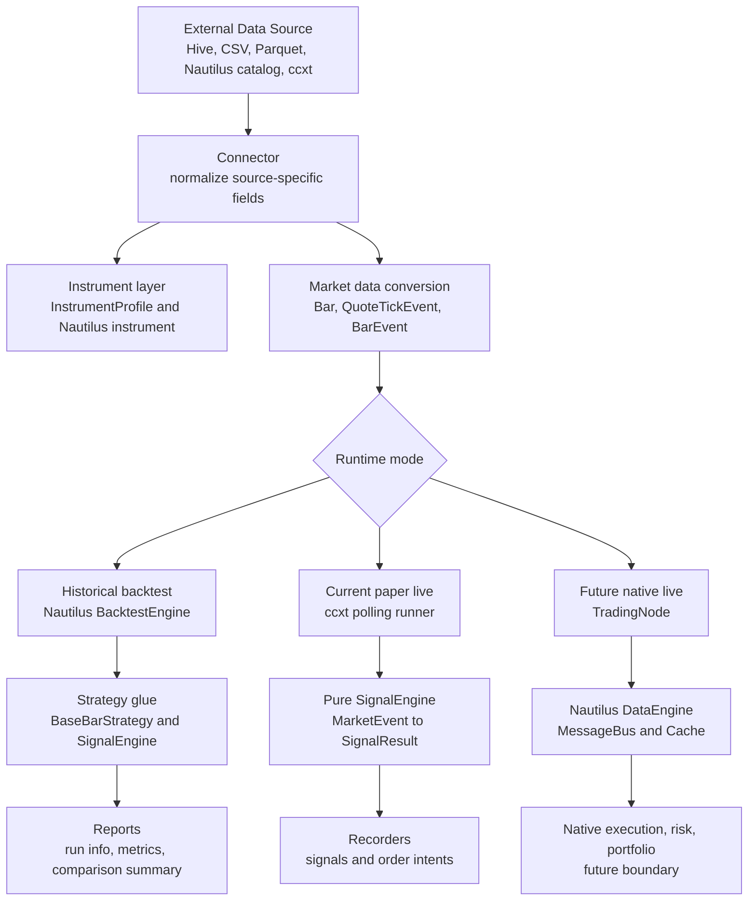
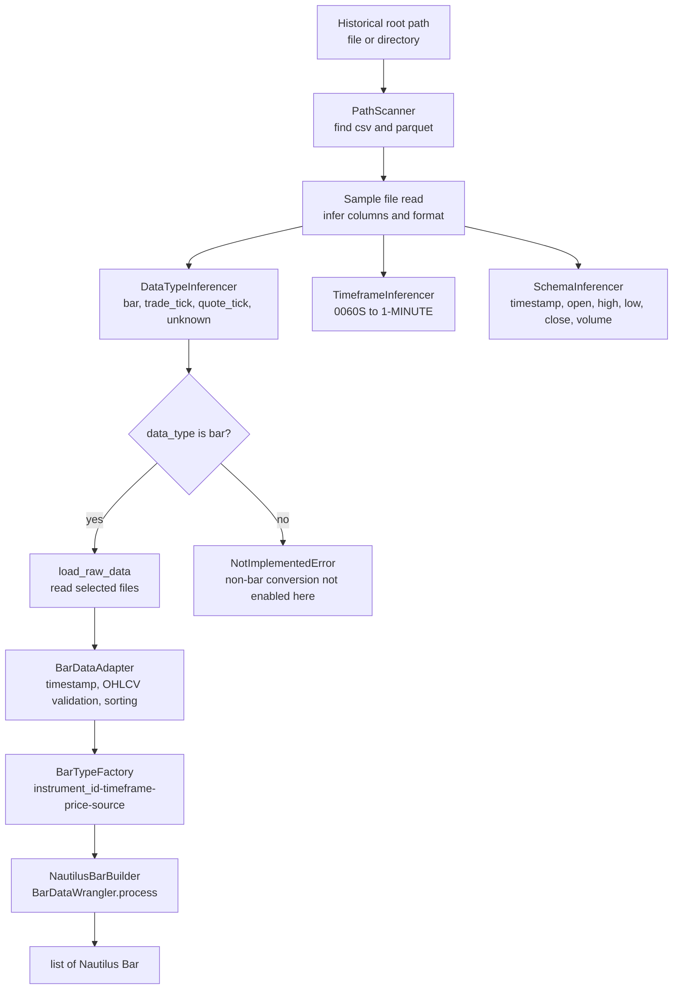
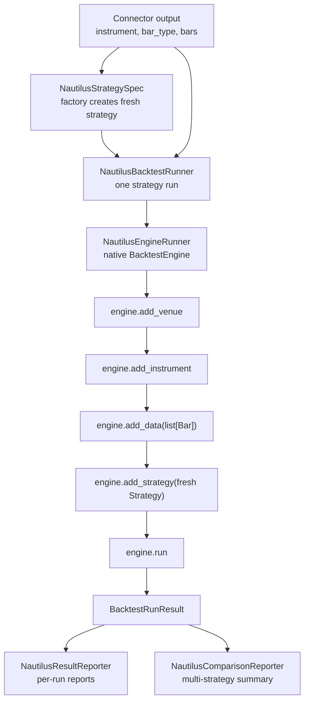
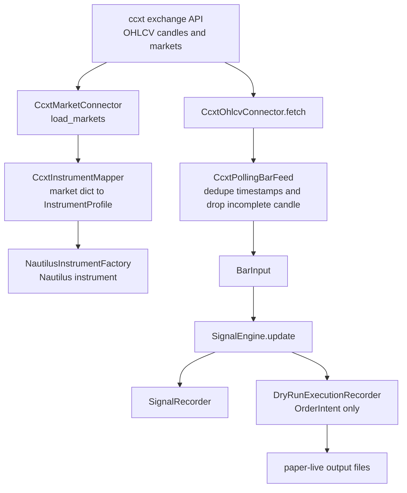
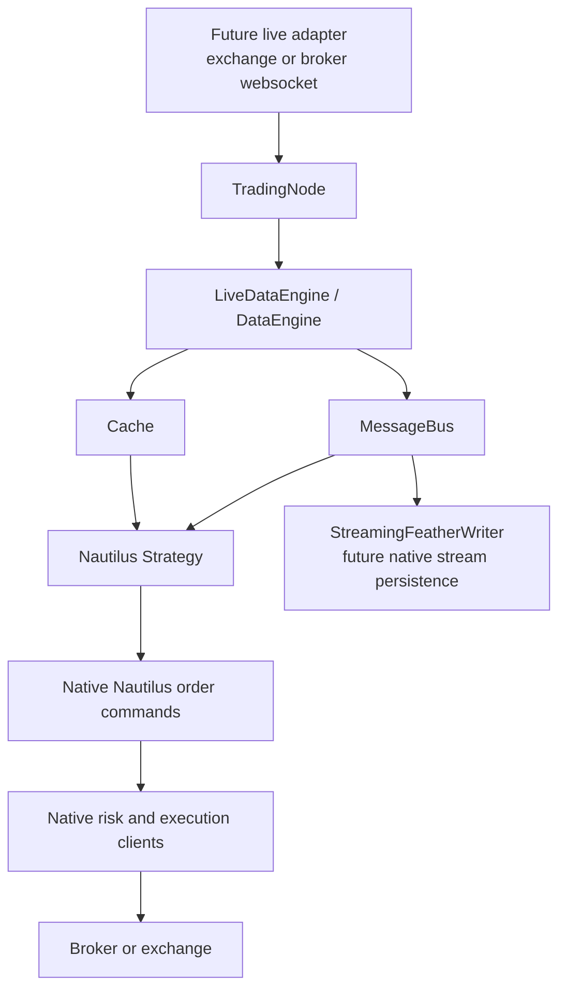
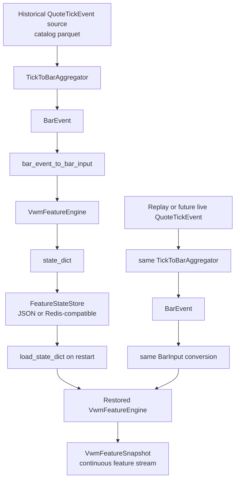
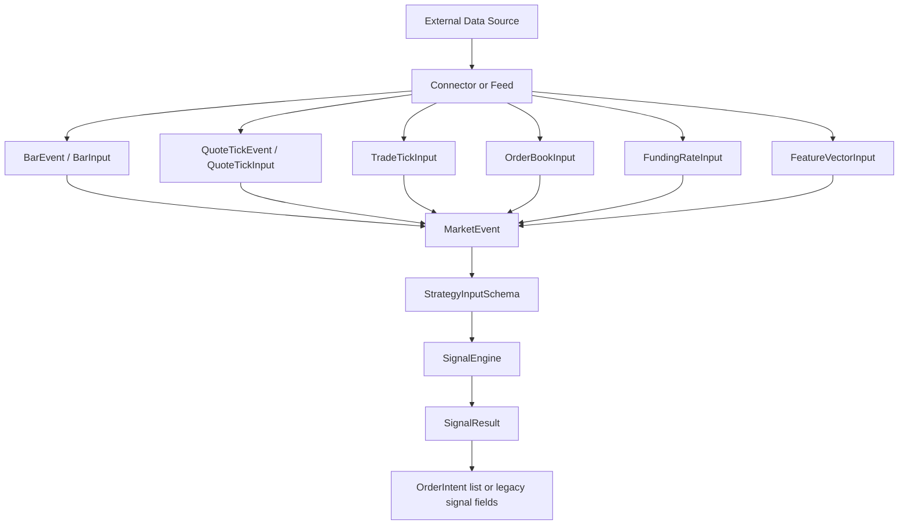
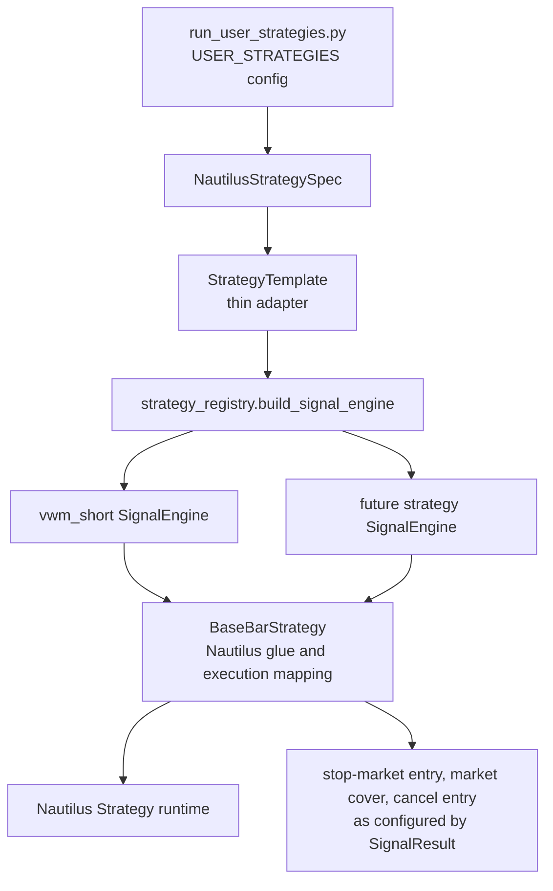
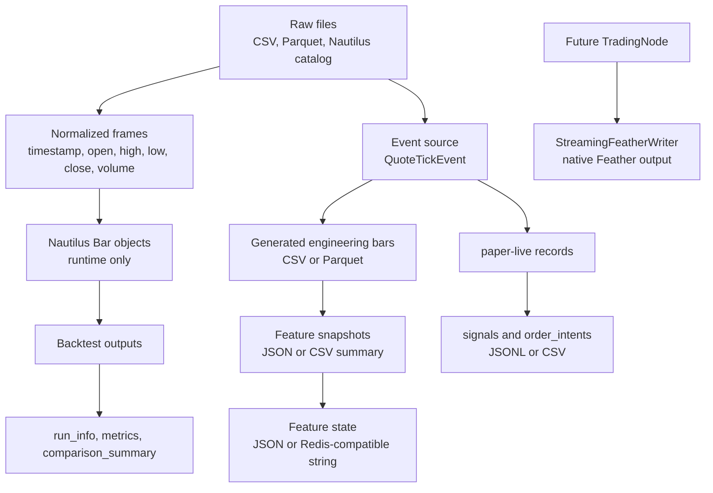
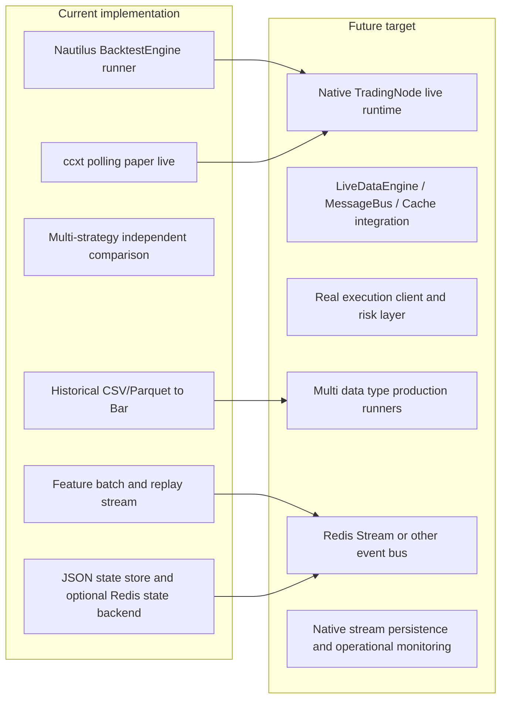

# Nautilus Ext Data Flow Architecture

This document describes how `nautilus_ext` moves market data from external
sources into Nautilus-native objects, how strategies consume normalized events,
and where the current implementation stops before future full `TradingNode`
live trading.

The key design rule is simple: `nautilus_ext` adapts internal or external data
into Nautilus-compatible runtime objects, but it does not replace Nautilus
Trader's native `BacktestEngine`, `Strategy`, order model, portfolio, matching,
`DataEngine`, `MessageBus`, or `Cache`.

## Table Of Contents

1. [Terminology](#terminology)
2. [Data Type Coverage](#data-type-coverage)
3. [Storage And Runtime Object Table](#storage-and-runtime-object-table)
4. [Figure 1: Global Data Architecture](#figure-1-global-data-architecture)
5. [Figure 2: Historical Data Ingestion And Conversion](#figure-2-historical-data-ingestion-and-conversion)
6. [Figure 3: Native Nautilus Backtest](#figure-3-native-nautilus-backtest)
7. [Figure 4: ccxt Polling Paper Live](#figure-4-ccxt-polling-paper-live)
8. [Figure 5: Future TradingNode Live](#figure-5-future-tradingnode-live)
9. [Figure 6: Historical Warmup And Live Incremental Feature Continuity](#figure-6-historical-warmup-and-live-incremental-feature-continuity)
10. [Figure 7: Mixed MarketEvent Data Types](#figure-7-mixed-marketevent-data-types)
11. [Figure 8: Strategy Development And Config Switching](#figure-8-strategy-development-and-config-switching)
12. [Figure 9: Storage And File Type Flow](#figure-9-storage-and-file-type-flow)
13. [Figure 10: Current Implementation Vs Future Target Boundary](#figure-10-current-implementation-vs-future-target-boundary)
14. [Current Vs Future Boundary](#current-vs-future-boundary)
15. [Boss Report Wording](#boss-report-wording)

## Terminology

- `External Data Source`: Company Hive, CSV, Parquet, Nautilus catalog parquet,
  or remote exchange APIs such as ccxt.
- `Connector`: A component that reads external data and returns normalized
  runtime objects. Examples: `NautilusAutoBarDataConnector`,
  `CcxtBarDataConnector`, `CatalogQuoteTickSource`.
- `Feed`: A polling or streaming component that emits incremental market data.
  Current implementation includes `CcxtPollingBarFeed` for polling candles.
- `MarketEvent`: A strategy-facing normalized event envelope for bars, ticks,
  book data, funding, or features.
- `SignalEngine`: A pure strategy signal component. It receives normalized
  inputs and returns `SignalResult`; it does not place orders.
- `SignalResult`: A normalized strategy decision object. Current versions keep
  legacy bar-strategy fields and newer order-intent style fields.
- `OrderIntent`: A planned order action emitted by a signal engine or adapter.
  In current paper-live code it is recorded by the dry-run recorder.
- `Recorder`: A component that writes run-time signals or dry-run order intents
  to local files. Examples: `SignalRecorder`, `DryRunExecutionRecorder`.
- `Runner`: A component that assembles data, strategy, engine, and reporting.
  Examples: `NautilusBacktestRunner`, `NautilusMultiStrategyRunner`,
  `CcxtPaperLiveRunner`.
- `Nautilus BacktestEngine`: Native Nautilus backtest runtime used by
  `NautilusEngineRunner`; not reimplemented by `nautilus_ext`.
- `TradingNode`: Future native Nautilus live-trading orchestration boundary.
- `DataEngine / MessageBus / Cache`: Native Nautilus data routing and state
  components used inside the Nautilus system kernel and live runtime.

## Data Type Coverage

| Data type | Current status in `nautilus_ext` | Primary runtime type | Notes |
|---|---:|---|---|
| OHLCV Bar | Implemented | Nautilus `Bar`, `BarInput`, `BarEvent` | Main supported strategy path. |
| QuoteTick | Implemented for event source and aggregation | `QuoteTickEvent` | Can be aggregated to synthetic-volume bars for engineering validation. |
| TradeTick | Interface placeholder | `TradeTickInput` | Strategy schema supports it; conversion path is not production-ready yet. |
| OrderBook | Interface placeholder | `OrderBookInput` | Strategy schema supports it; no full book strategy runner yet. |
| FundingRate | Interface placeholder | `FundingRateInput` | Strategy schema supports it; no live feed runner yet. |
| FeatureVector | Interface placeholder | `FeatureVectorInput` | Intended for future multi-factor or ML features. |
| Instrument metadata | Implemented for profiles and selected construction | `InstrumentProfile`, Nautilus instrument | `crypto_perpetual` construction is supported; other types are registry/adapter skeletons unless metadata is complete. |

## Storage And Runtime Object Table

| Data name | Runtime type | Storage format | Filename example | Stage | Purpose | Reproducibility |
|---|---|---|---|---|---|---|
| Raw company CSV bars | `pandas.DataFrame` | CSV | `bars_2024.csv` | Input | Internal historical bar ingestion | Reproducible if file snapshot is versioned. |
| Raw company parquet bars | `pandas.DataFrame` | Parquet | `bars_2024.parquet` | Input | Internal historical bar ingestion | Reproducible if parquet snapshot is immutable. |
| Nautilus catalog quote ticks | `QuoteTickEvent` after reading | Parquet catalog | `data/quote_tick/IH2303.CFFEX/...parquet` | Input | Engineering source for tick-to-bar aggregation | Reproducible if catalog partition is fixed. |
| Normalized OHLCV frame | `pandas.DataFrame` | In memory or optional CSV/Parquet | `IH2303_CFFEX_1min_bars.csv` | Conversion | Standard bar schema for `BarDataWrangler` | Reproducible if generated with fixed interval and source files. |
| Nautilus bars | `list[Bar]` | In memory | N/A | Runtime | Native backtest data injection | Reproducible from normalized frame plus instrument metadata. |
| Generated engineering bars | `BarEvent` / `BarInput` | CSV or Parquet | `outputs/generated_bars/IH2303_CFFEX_1min_bars.csv` | Validation | QuoteTick to bar engineering bridge | Synthetic volume must be disclosed. |
| Feature snapshots | `VwmFeatureSnapshot` | JSON or CSV summary | `outputs/flow_batch_features/features.json` | Feature calculation | Validate batch and replay stream features | Reproducible from event source and feature config. |
| Feature state | `dict` | JSON or Redis-compatible JSON string | `outputs/feature_states/IH2303_CFFEX_1min_vwm_state.json` | Warmup / live restart | Restore feature engine state | Reproducible if state version and config match. |
| Backtest report | `BacktestRunResult`, reports | JSON / CSV / Markdown | `outputs/user_strategies/<run_id>/run_info.json` | Result | Per-strategy run evidence | Reproducible from data, config, code version. |
| Comparison report | list of `BacktestRunResult` | CSV / JSON / Markdown | `comparison_summary.csv` | Result | Multi-strategy independent comparison | Reproducible if all run ids and configs are recorded. |
| Paper-live signals | `SignalResult` records | JSONL / CSV | `signals.jsonl` | Current paper live | Dry-run audit trail | Reproducible as observed polling output, subject to exchange API history availability. |
| Paper-live order intents | `OrderIntent` records | JSONL / CSV | `order_intents.jsonl` | Current paper live | No-real-order dry-run evidence | Reproducible as dry-run logs only. |
| Nautilus future stream output | Nautilus events | Feather / internal DB | `StreamingFeatherWriter` output | Future native live | Native Nautilus stream persistence | Future target; not current `nautilus_ext` paper-live output. |

## Figure 1: Global Data Architecture

This is the top-level view. `nautilus_ext` owns source adaptation, internal
data normalization, strategy signal wiring, lightweight paper-live validation,
and reporting. Native Nautilus remains responsible for the real backtest engine
and the future live-trading runtime.

Runtime object types: `InstrumentProfile`, Nautilus instrument objects, `Bar`,
`QuoteTickEvent`, `BarEvent`, `BarInput`, `MarketEvent`, `SignalResult`,
`OrderIntent`, `BacktestRunResult`.

Storage file types: source CSV/Parquet, Nautilus catalog parquet, generated
engineering CSV/Parquet, JSON feature state, JSONL/CSV paper-live records,
JSON/CSV/Markdown reports.

## Figure 2: Historical Data Ingestion And Conversion

The historical connector path is implemented primarily by
`nautilus_ext/connectors/auto_bar_data_connector.py` and the discovery,
adapter, and builder modules. It deliberately stops at Nautilus-native `Bar`
objects; it does not implement any matching or portfolio logic.

Runtime object types: `DatasetProfile`, `BarFieldMapping`, normalized
`pandas.DataFrame`, Nautilus `BarType`, `list[Bar]`.

Storage file types: source CSV/Parquet and optional generated normalized
CSV/Parquet. Nautilus catalog parquet can be read by separate event sources.

## Figure 3: Native Nautilus Backtest

This path uses Nautilus-native `BacktestEngine`. `nautilus_ext` only assembles
the engine with data, venue, instrument, and a fresh strategy instance. In
multi-strategy comparison, each strategy gets a fresh engine and fresh strategy;
only the prepared bars cache can be shared by the connector.

Runtime object types: `EngineRunConfig`, `NautilusStrategySpec`,
`StrategyContext`, Nautilus `Strategy`, Nautilus `BacktestEngine`,
`BacktestRunResult`.

Storage file types: input bars from CSV/Parquet or generated files, per-run
`run_info.json`, optional metrics JSON, comparison CSV/JSON/README.

## Figure 4: ccxt Polling Paper Live

This is current paper-live validation, not full live trading. It polls exchange
bars through ccxt, converts them to strategy inputs, and records signals or dry
order intents. It does not use Nautilus `TradingNode`, and it does not send real
orders.

Runtime object types: ccxt market dictionaries, `InstrumentProfile`, Nautilus
instrument, `BarInput`, `SignalResult`, `OrderIntent`.

Storage file types: current paper-live records such as JSONL/CSV signal logs,
dry-run order intent logs, and run-info JSON. These files are local validation
artifacts, not Nautilus native live persistence.

## Figure 5: Future TradingNode Live

This figure is a future target boundary. The current `ccxt_live` paper runner is
useful for engineering validation, but production live trading should move
toward Nautilus `TradingNode`, native `LiveDataEngine`, `MessageBus`, `Cache`,
risk engine, and execution clients.

Runtime object types: native Nautilus data events, Nautilus `Strategy`,
`MessageBus` messages, `Cache` state, native orders and fills.

Storage file types: future native stream output through Nautilus persistence
such as `StreamingFeatherWriter`, plus operational logs. This is not the current
paper-live recorder output.

## Figure 6: Historical Warmup And Live Incremental Feature Continuity

Warmup prepares feature state from historical data without placing orders. The
same feature engine then continues from restored state when replay or future
live events arrive. This keeps batch calculation and incremental calculation on
one code path.

Runtime object types: `QuoteTickEvent`, `BarEvent`, `BarInput`,
`VwmFeatureEngine`, `VwmFeatureSnapshot`, feature state `dict`.

Storage file types: JSON feature-state files under `outputs/feature_states`, or
optional Redis/Valkey-compatible JSON values. Redis is an optional real-time
state backend, not the historical market-data store.

## Figure 7: Mixed MarketEvent Data Types

The strategy interface is intentionally broader than the current VWM bar-only
strategy. `BarInput` is production-usable today for existing examples, while
trade, quote, order-book, funding, and feature-vector inputs are part of the
common strategy interface for future engines.

Runtime object types: `MarketEvent`, `BarInput`, `TradeTickInput`,
`QuoteTickInput`, `OrderBookInput`, `FundingRateInput`, `FeatureVectorInput`,
`StrategyInputSchema`, `SignalResult`, `OrderIntent`.

Storage file types: source parquet/CSV/catalog data, generated feature
snapshots, and signal/order-intent logs. Unsupported data types should remain
explicitly marked as interface or skeleton until conversion and runner support
are complete.

## Figure 8: Strategy Development And Config Switching

New strategy development should not add more `if/else` blocks to
`StrategyTemplate`. The intended path is to add a pure signal module, register a
factory in the strategy registry, and switch `strategy_kind` plus parameters in
`run_user_strategies.py`.

Runtime object types: `NautilusStrategySpec`, `StrategyContext`,
`StrategyTemplate`, `BaseBarStrategy`, `SignalEngine`, `SignalResult`.

Storage file types: strategy configuration in Python examples today, and
report outputs after runs. A future production setup may externalize strategy
configs to YAML/JSON, but that is not required by the current code path.

## Figure 9: Storage And File Type Flow

The current extension mostly stores generated artifacts under `outputs/` and
reads official or internal data from their original locations. It must not write
engineering outputs back into the true Nautilus catalog or company raw catalog.

Runtime object types: `pandas.DataFrame`, `QuoteTickEvent`, `BarEvent`,
`BarInput`, Nautilus `Bar`, `FeatureSnapshot`, state `dict`.

Storage file types: CSV, Parquet, JSON, JSONL, Markdown, Redis-compatible JSON
strings, and future Nautilus Feather stream files.

## Figure 10: Current Implementation Vs Future Target Boundary

This boundary is important for reporting. The current system can validate data
conversion, feature continuity, strategy signal behavior, native Nautilus
backtests, and paper-live dry-run behavior. It is not yet a production live
trading stack.

Runtime object types currently proven include `Bar`, `BarInput`,
`QuoteTickEvent`, `BarEvent`, `VwmFeatureSnapshot`, `SignalResult`, and
`BacktestRunResult`. Future target runtime objects include full Nautilus live
data events, live cache state, execution commands, fills, and live risk events.

Storage file types currently proven include CSV/Parquet inputs, generated
engineering outputs, JSON state, and report artifacts. Future target storage
includes native Nautilus live-stream persistence and operational telemetry.

## Current Vs Future Boundary

Implemented now:

- Historical bar ingestion from CSV/Parquet into Nautilus `Bar` objects.
- Internal schema/timeframe inference for bar data.
- ccxt OHLCV bar conversion into Nautilus-compatible bars.
- Native Nautilus `BacktestEngine` assembly and execution.
- Multi-strategy independent backtest comparison.
- Bar-based `StrategyTemplate` plus `BaseBarStrategy` execution glue.
- Pure signal-engine registry and current VWM short signal engine.
- QuoteTick event reading, tick-count bar aggregation, batch feature pipeline,
  replay stream feature pipeline, warmup, JSON state, and optional Redis state
  backend.
- Current paper-live polling path that records signals and dry-run order
  intents, without real order routing.

Planned or future:

- Full Nautilus `TradingNode` live integration.
- Native `LiveDataEngine`, `MessageBus`, and `Cache` driven live strategy flow.
- Production broker/exchange execution and risk management.
- Production runners for TradeTick, QuoteTick, OrderBook, FundingRate, and
  FeatureVector strategies.
- Redis Stream or equivalent event bus for live event buffering.
- Full operational monitoring, reconnect handling, late-event policies, and
  session-calendar handling.

## Boss Report Wording

Recommended wording:

> We have built a layered `nautilus_ext` architecture that converts internal
> and external market data into Nautilus-compatible runtime objects, runs
> historical backtests through the native Nautilus `BacktestEngine`, supports
> reusable strategy signal engines, and validates batch/replay feature
> continuity. The current paper-live path is an engineering dry-run path that
> records signals and order intents; it is not yet production live trading.

For data coverage:

> The production-ready strategy path today is OHLCV Bar based. QuoteTick data
> can be converted into engineering bars with synthetic tick-count volume for
> pipeline validation. This synthetic volume must not be reported as real traded
> volume or used for formal performance claims.

For future live trading:

> The intended next stage is to connect the same data normalization, feature,
> and signal-engine layers to Nautilus `TradingNode`, `LiveDataEngine`,
> `MessageBus`, `Cache`, native risk, and native execution clients. Redis or
> Valkey can support real-time state or event-buffering, but it should not
> replace the historical Parquet/catalog data store.

