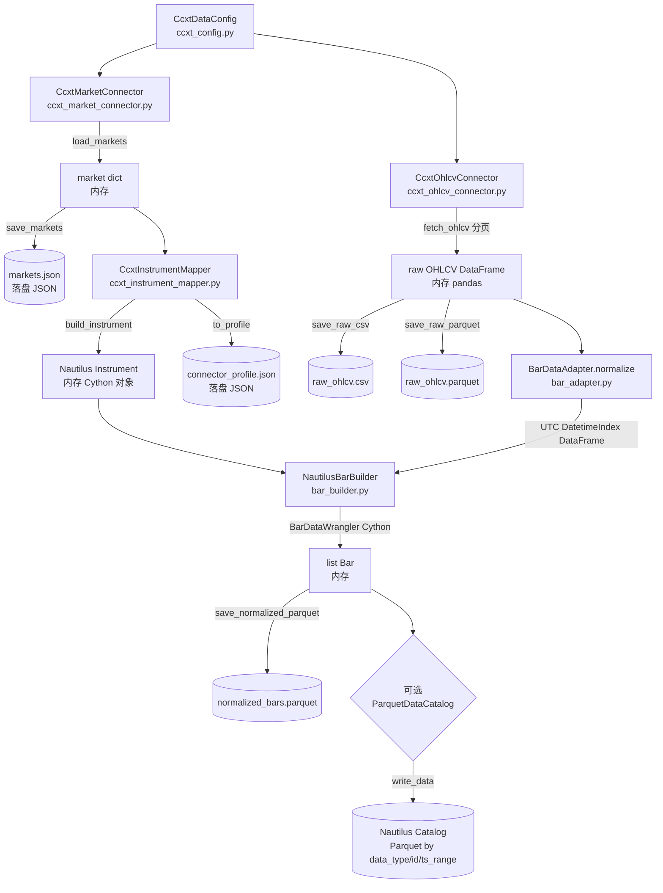
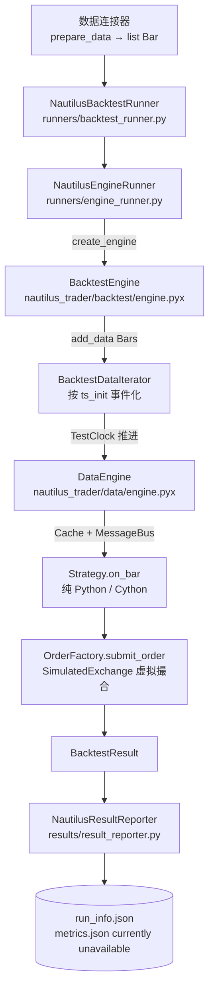
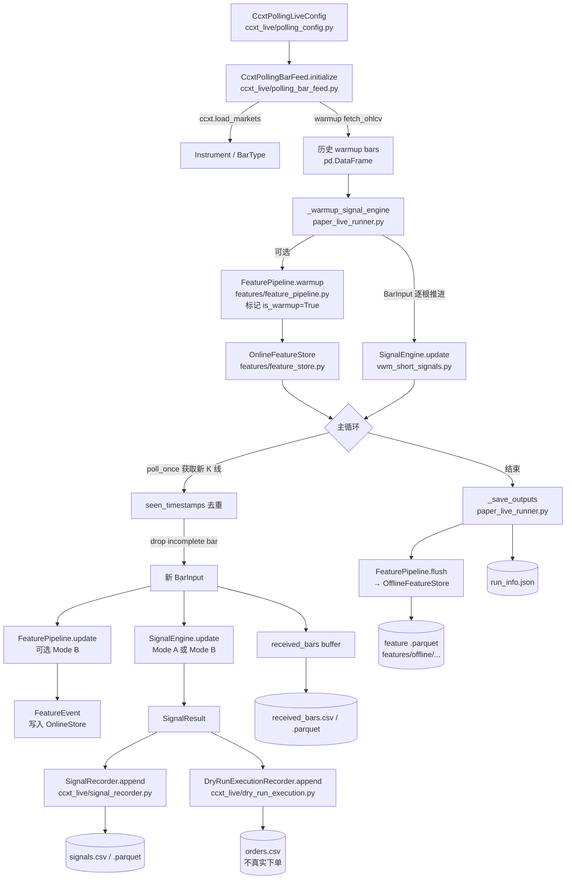
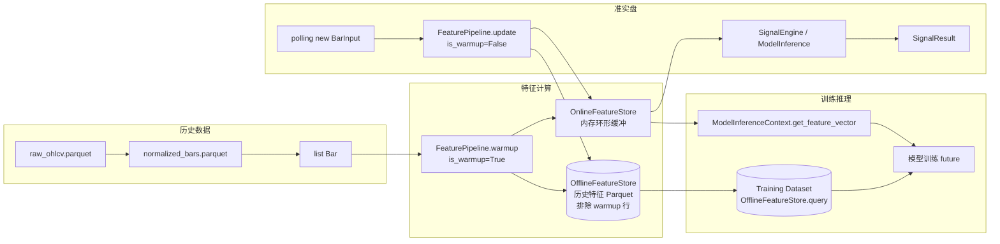
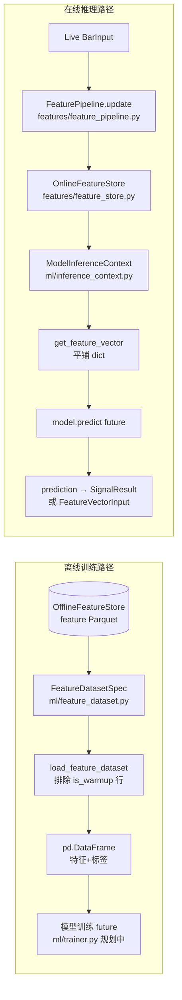

# nautilus_ext 数据流、存储与特征复用机制分析

> **适用版本：** nautilus_trader 1.227.0 / nautilus_ext（含 Feature Data Layer）  
> **文档性质：** 技术审计 + 架构分析，基于逐文件代码阅读  
> **审计时间：** 2026-06-04

---

## 目录

1. [总体结论](#1-总体结论)
2. [数据类型总览](#2-数据类型总览)
3. [历史数据接入与存储流程](#3-历史数据接入与存储流程)
4. [回测流程中数据如何流动](#4-回测流程中数据如何流动)
5. [Polling Paper Live 数据流程](#5-polling-paper-live-数据流程)
6. [历史数据、当时数据与特征如何共存](#6-历史数据当时数据与特征如何共存)
7. [特征当前在哪里存在，未来应该在哪里存在](#7-特征当前在哪里存在未来应该在哪里存在)
8. [为什么 signals.csv 不能等同于特征库](#8-为什么-signalscsv-不能等同于特征库)
9. [实时低延迟路径与离线持久化路径](#9-实时低延迟路径与离线持久化路径)
10. [特征如何流向模型训练与推理](#10-特征如何流向模型训练与推理)
11. [新增策略与新增特征需要改哪些代码](#11-新增策略与新增特征需要改哪些代码)
12. [当前实现边界与风险](#12-当前实现边界与风险)
13. [逐文件职责表](#13-逐文件职责表)
14. [给老板的汇报话术](#14-给老板的汇报话术)

---

## 1. 总体结论

当前系统以 `nautilus_ext` 作为 `nautilus_trader` 原生 Cython 框架的扩展层，覆盖了从原始市场数据接入、标准化处理、历史回测、特征计算，到准实盘 polling 循环的完整链路。

**数据接入层**分为两条通道：一是通过 `nautilus_ext/ccxt/` 的 ccxt REST 接口拉取交易所 OHLCV 历史数据，二是通过 `nautilus_ext/connectors/` 读取本地 CSV/Parquet 文件。两条通道最终都输出标准化 Nautilus `Bar` 列表，统一供回测引擎或特征引擎消费。

**特征计算层**已经完成从"嵌入式"到"独立资产"的升级。在旧设计中，特征（VWM、ATR、动量等）只是信号引擎的内部中间变量，以 `SignalResult.debug` 字段的形式间接写入 `signals.csv`，本质上是信号表的附属产物。新设计引入了完整的 Feature Data Layer（`nautilus_ext/features/` 目录）：特征被定义为带版本、带 Schema、带时间戳的独立 `FeatureEvent` 对象，通过 `FeaturePipeline` 统一管理，经 `OnlineFeatureStore`（内存环形缓冲）服务实时策略，经 `OfflineFeatureStore`（批量 Parquet）服务历史训练，整体地位与原始行情数据平级。

**Polling Paper Live 层**（`nautilus_ext/ccxt_live/`）是独立于 Nautilus `TradingNode` 的轻量循环：用 ccxt REST 轮询新 K 线，驱动纯 Python 信号引擎，将所有产物记录到 CSV/Parquet，**不进行真实下单**。`dry_run_execution.py` 记录的 `orders.csv` 是意图级别的 dry-run 记录，与交易所没有任何网络交互。

**当前已实现但尚需完善的环节：** 回测结果 `metrics.json` 当前固定返回 `{"available": false}`，PnL、夏普比率、最大回撤等量化指标尚未从 Nautilus `BacktestEngine` 中提取输出；`session_reporter.py`（准实盘会话汇总）在本地仓库中未发现，该功能缺失。特征层的 `OfflineFeatureStore` 已经落盘 Parquet，ML 读取接口（`ml/feature_dataset.py`、`ml/inference_context.py`）骨架已完成，但尚未连接真实模型训练流程。

---

## 2. 数据类型总览

| # | 数据名称 | 运行时类型 | 文件存储格式 | 典型文件名 | 产生阶段 | 消费方 | 实现文件 |
|---|----------|------------|-------------|-----------|----------|--------|----------|
| 1 | ccxt market metadata | `dict` | JSON | `markets.json` | 历史接入 | `CcxtInstrumentMapper` | `ccxt_market_connector.py` |
| 2 | InstrumentProfile | `dict` (中间格式) | JSON | `connector_profile.json` | 历史接入 | `CcxtInstrumentMapper` | `ccxt_instrument_mapper.py` |
| 3 | Nautilus Instrument | Nautilus Cython 对象 | 无（内存） | — | 历史接入 | 回测引擎 / BarBuilder / live feed | `ccxt_instrument_mapper.py` |
| 4 | BarType | Nautilus Cython 对象 | 无（内存） | — | 历史接入 | BacktestEngine / FeaturePipeline | `bar_type_factory.py` |
| 5 | raw OHLCV DataFrame | `pd.DataFrame` | CSV + Parquet | `raw_ohlcv.csv` / `raw_ohlcv.parquet` | ccxt 历史下载 | `CcxtBarMapper` | `ccxt_ohlcv_connector.py` |
| 6 | normalized bar DataFrame | `pd.DataFrame` | Parquet | `normalized_bars.parquet` | 数据适配 | `NautilusBarBuilder` | `bar_adapter.py` |
| 7 | Nautilus Bar 列表 | `list[Bar]` | 无（内存） | — | 历史接入 / 本地连接器 | BacktestEngine / warmup | `bar_builder.py` / `ccxt_bar_mapper.py` |
| 8 | BarInput | `BarInput`（冻结 dataclass） | 无（内存） | — | 信号处理热路径 | SignalEngine / FeatureEngine | `interfaces/input_types.py` |
| 9 | MarketEvent | `MarketEvent`（父类） | 无（内存） | — | 信号处理热路径 | 所有引擎 | `interfaces/input_types.py` |
| 10 | **FeatureEvent** | `FeatureEvent`（冻结 dataclass） | Parquet | `{start_ts}-{end_ts}.parquet` | 特征计算 | SignalEngine / ML 推理 / OfflineStore | `features/feature_event.py` |
| 11 | FeatureSetSpec（Schema） | `FeatureSetSpec` dataclass | JSON | `{feature_set_id}_{version}.json` | 特征注册 | OfflineStore / ML Dataset | `features/feature_schema.py` |
| 12 | SignalResult | `SignalResult`（冻结 dataclass） | 无（内存） | — | 信号处理 | SignalRecorder / DryRunExecutionRecorder | `interfaces/output_types.py` |
| 13 | OrderIntent | `OrderIntent`（冻结 dataclass） | 无（内存） | — | 信号处理 | DryRunExecutionRecorder | `interfaces/output_types.py` |
| 14 | received bars | `list[dict]` → DataFrame | CSV + Parquet | `received_bars.csv` / `.parquet` | polling live | 复盘 / 监控 | `paper_live_runner.py` |
| 15 | signals | DataFrame（26列） | CSV + Parquet | `signals.csv` / `signals.parquet` | polling live | 复盘 / 绩效分析 | `signal_recorder.py` |
| 16 | dry-run orders | DataFrame | CSV | `orders.csv` | polling live | 复盘（不真实下单） | `dry_run_execution.py` |
| 17 | run_info | `dict` | JSON | `run_info.json` | 回测/live 结束 | 监控 / CI | `result_reporter.py` / `paper_live_runner.py` |
| 18 | StrategySpecV2 | `StrategySpecV2` dataclass | JSON（外部配置） | 用户自定义 | 策略配置 | BacktestRunner / PaperLiveRunner | `interfaces/strategy_schema.py` |
| 19 | feature state / checkpoint | `dict` | JSON | `{run_id}_feature_state.json` | 特征存档 | FeaturePipeline 恢复 | `features/feature_checkpoint.py` |
| 20 | metrics | `dict` | JSON | `metrics.json` | 回测结束 | 监控（当前`available=false`） | `results/result_reporter.py` |

---

## 3. 历史数据接入与存储流程

### 3.1 CCXT 远程数据接入流程



**逐步说明：**

| 步骤 | 实现文件 | 输入类型 | 输出类型 | 落盘 |
|------|----------|----------|----------|------|
| 1. 读取配置 | `ccxt/ccxt_config.py` → `CcxtDataConfig` | YAML/代码参数 | 配置对象 | 否 |
| 2. 拉取市场元数据 | `ccxt/ccxt_market_connector.py` → `load_markets()` | ccxt exchange 对象 | `dict`（ccxt 原始市场字典） | `markets.json` |
| 3. 映射合约 | `ccxt/ccxt_instrument_mapper.py` → `build_instrument()` | market dict + 精度模式 | Nautilus `Instrument` Cython 对象 | `connector_profile.json` |
| 4. 分页拉取 OHLCV | `ccxt/ccxt_ohlcv_connector.py` → `fetch()` | ccxt symbol、since_ms、until_ms | `pd.DataFrame`（含 timestamp_ms 列） | `raw_ohlcv.csv` / `.parquet` |
| 5. 标准化 | `adapters/bar_adapter.py` → `normalize()` | 原始 DataFrame（任意列名） | 标准 DataFrame（UTC 时间索引，float OHLCV） | `normalized_bars.parquet` |
| 6. 构造 Nautilus Bar | `builders/bar_builder.py` → `NautilusBarBuilder` | 标准 DataFrame + Instrument + BarType | `list[Bar]`（Nautilus Cython 对象） | 否（内存） |
| 7. 目录管理 | `ccxt/ccxt_cache.py` → `CcxtCache` | exchange_id + symbol + timeframe | 路径对象 | 组织目录结构 |
| 8. 高层门面 | `ccxt/ccxt_connector.py` → `CcxtBarDataConnector` | `CcxtDataConfig` | `list[Bar]` + 各文件路径 | 汇总以上所有文件 |

**timestamp 转换细节：**  
`ccxt.fetch_ohlcv()` 返回毫秒级 POSIX 时间戳（`timestamp_ms`）。`BarDataAdapter.normalize()` 将其转成 UTC `DatetimeIndex`。`NautilusBarBuilder` 内部调用 `BarDataWrangler`（Nautilus Cython），将 UTC 时间转成 Nautilus 原生 nanosecond 整数（`ts_event = timestamp_ms * 1_000_000`，`ts_init` 通常等于 `ts_event`）。

**ParquetDataCatalog 说明：**  
`nautilus_trader/persistence/catalog/parquet.py` 中的 `ParquetDataCatalog` 基于 `fsspec` 和 `pyarrow`，按 `data_type / instrument_id / ts_range` 分区存储 Nautilus 对象（Bar、TradeTick 等），使用 Arrow 序列化。当前 `ccxt_connector.py` 的 `normalized_bars.parquet` 是简单 pandas Parquet，不经过 `ParquetDataCatalog`；若需纳入原生 Catalog，需在 `CcxtBarDataConnector` 中额外调用 `catalog.write_data(bars)`。

### 3.2 本地 CSV/Parquet 数据接入流程

```
本地 CSV/Parquet 文件
    → PathScanner（discovery/path_scanner.py）     发现文件列表
    → SchemaInferencer（discovery/schema_inferencer.py）   自动推断列名
    → DatasetProfile（discovery/dataset_profile.py）   描述数据集
    → NautilusAutoBarDataConnector（connectors/auto_bar_data_connector.py）
        → load_raw_data() → pd.DataFrame
        → BarDataAdapter.normalize() → 标准化 DataFrame
        → BarTypeFactory.build()（builders/bar_type_factory.py）→ BarType
        → NautilusBarBuilder（builders/bar_builder.py）→ list[Bar]
```

`NautilusAutoBarDataConnector` 是只读连接器，不写任何文件。它与 `CcxtBarDataConnector` 实现相同的接口（`prepare_data()` → `list[Bar]`、`get_bar_type()`、`instrument`），因此可以无缝替换供 `NautilusBacktestRunner` 使用。

---

## 4. 回测流程中数据如何流动



**关键设计说明：**

1. **历史数据不是一次性批量算完。** `BacktestEngine` 将所有 `Bar` 按 `ts_init` 时间戳组织成事件队列，由 `TestClock` 按时序逐一推进。每个时间点，数据事件发布到 `MessageBus`，策略的 `on_bar()` 回调才被触发。这保证了与实时环境相同的事件语义，不存在未来信息泄露。

2. **内存 vs 落盘：** 回测过程中，`Bar` 列表、`Cache`（Order/Position/Account 状态）、`MessageBus` 消息均在内存中。回测结束后，`NautilusResultReporter` 将摘要写入 `run_info.json` 和 `metrics.json`。目前 `metrics.json` 固定为 `{"available": false}`，PnL、夏普率等指标尚未从 `BacktestEngine.get_result()` 中提取——这是当前实现的明显缺口。

3. **回测报告文件：**
   - `run_info.json`：run_id、strategy_name、bar_type、bars_count、status
   - `metrics.json`：当前固定 `{"available": false}`（待实现）
   - `comparison_summary.csv/json`：多策略对比时，由 `NautilusComparisonReporter` 生成

4. **与 Feature Data Layer 的关系：** 当前 `NautilusBacktestRunner` 不包含 `FeaturePipeline`。回测中的特征计算仍然是策略内部的（VwmFeatureEngine 内嵌在 VolumeWeightedMomentumShortSignalEngine 中），尚未外接 `FeaturePipeline`。如需回测时同时产生历史特征 Parquet，需在 `NautilusBacktestRunner` 中集成 `FeaturePipeline`——这是规划中的改进（future）。

---

## 5. Polling Paper Live 数据流程



**逐步说明：**

| 步骤 | 实现文件 | 说明 |
|------|----------|------|
| 1. 配置加载 | `ccxt_live/polling_config.py` | 安全约束：`enable_order_submit` 默认 False，置 True 时只抛 `NotImplementedError` |
| 2. 初始化 | `ccxt_live/polling_bar_feed.py` → `initialize()` | 调用 ccxt `load_markets()`，建 Instrument / BarType |
| 3. Warmup | `ccxt_live/polling_bar_feed.py` → `warmup()` | 拉取 `config.warmup_bars` 根历史 K 线，返回 DataFrame；带 `is_warmup=True` 标记 |
| 4. 引擎预热 | `ccxt_live/paper_live_runner.py` → `_warmup_signal_engine()` | 逐根喂入 `BarInput`，使信号引擎和特征引擎达到有效状态 |
| 5. 去重机制 | `ccxt_live/polling_bar_feed.py` → `_seen_ts: set` | `poll_once()` 返回仅包含首次出现的 `timestamp_ms` 的行，防止重复处理同一根 K 线 |
| 6. 丢弃未完成 K 线 | `ccxt_live/polling_bar_feed.py` | 若 `config.drop_incomplete_bar=True`，去除最新一根（可能尚未收盘）避免信号漂移 |
| 7. 信号计算 | `strategies/vwm_short_signals.py` | Mode A：信号引擎内部维护特征；Mode B：从 `FeaturePipeline` 获取特征，经 `StrategyRuntimeContext` 传入 |
| 8. 信号记录 | `ccxt_live/signal_recorder.py` → 26 列 DataFrame | 包含 OHLCV + 特征快照 + 信号字段，落盘到 `signals.csv/parquet` |
| 9. 订单记录 | `ccxt_live/dry_run_execution.py` | 记录 OrderIntent 到 `orders.csv`，**不与交易所通信，不真实下单** |
| 10. 特征持久化 | `paper_live_runner.py` → `_save_outputs()` | `FeaturePipeline.flush()` 将缓冲区写入 `OfflineFeatureStore`，保存分区 Parquet |
| 11. 会话汇总 | `paper_live_runner.py` | 写 `run_info.json`；`session_reporter.py` **在当前仓库中未发现**（功能缺失） |

**注意：** 当前 `CcxtPaperLiveRunner` **不是** Nautilus `TradingNode` / `LiveDataEngine`，不经过 Nautilus `DataEngine.pyx` 的 MessageBus，不使用 Nautilus `Portfolio` 或 `RiskEngine`，因此当前没有实时 PnL 计算和风险控制。

---

## 6. 历史数据、当时数据与特征如何共存



### 6.1 历史数据的作用

- **离线回测**：`list[Bar]` 喂入 `BacktestEngine`，按时序逐根触发策略 `on_bar()`
- **Warmup 预热**：polling live 启动前，拉取 `config.warmup_bars` 根历史 K 线，使信号引擎和特征引擎从"冷启动"进入有效状态
- **生成历史特征**：`FeaturePipeline.warmup()` 遍历历史 bar，产生带 `is_warmup=True` 标记的 `FeatureEvent`，存入 `OfflineFeatureStore`
- **训练数据基础**：`OfflineFeatureStore.query()` 默认排除 `is_warmup=True` 的行，保证训练集不含预热期数据（point-in-time correctness）

### 6.2 当时数据 / Polling Live 数据的作用

- **增量推进信号引擎**：每根新 K 线触发 `signal_engine.update()`，更新内部状态机
- **更新最新特征**：`FeaturePipeline.update()` 产生 `FeatureEvent`，立即写入 `OnlineFeatureStore`（零文件 I/O）
- **触发信号**：`SignalResult` 包含 `entry_side`、`exit_side`、`OrderIntent` 列表
- **增量记录**：新 bar 数据追加到 `SignalRecorder` 缓冲，会话结束时批量落盘
- **未来在线推理**：`ModelInferenceContext.get_feature_vector()` 从 `OnlineFeatureStore` 读取最新特征向量，可直接传入模型

### 6.3 计算后特征的正确存在形式

当前 `SignalRecorder` 的 `signals.csv` 中包含 `momentum`、`vwm`、`atr`、`bull_setup`、`bear_setup` 列——这是特征数据"混入"信号表的旧做法，存在以下问题（详见第 8 节）：

新做法（已实现）：`FeatureEvent` 独立落盘，不再依附于 `signals.csv`。具体路径：

```
features/offline/{feature_set_id}/{instrument_id}/{start_ts}-{end_ts}.parquet
features/schemas/{feature_set_id}_{version}.json
```

每个 `FeatureEvent` 包含：`ts_event`、`instrument_id`、`feature_set_id`、`feature_version`、`values` 字典、`is_warmup` 标记、`metadata`。

---

## 7. 特征当前在哪里存在，未来应该在哪里存在

### A. Feature Data Layer 已实现部分

| 组件 | 实现文件 | 说明 |
|------|----------|------|
| **FeatureEvent** | `features/feature_event.py` | 冻结 dataclass，含 `to_row()` / `from_row()` 序列化 |
| **FeatureSetSpec（Schema）** | `features/feature_schema.py` | 含字段名/类型/版本，可 save/load JSON |
| **BaseFeatureEngine Protocol** | `features/feature_engine.py` | 结构化协议 + ABC，所有特征引擎必须实现 |
| **FeatureRegistry** | `features/feature_registry.py` | `@register_feature_engine` 装饰器 + `build_feature_engine()` 工厂 |
| **OnlineFeatureStore** | `features/feature_store.py` | 每 (instrument_id, feature_set_id) 一个 `deque(maxlen=500)`，O(1) 实时访问 |
| **OfflineFeatureStore** | `features/feature_store.py` | 批量缓冲 1000 条后 flush 到 Parquet，分区路径含时间戳范围 |
| **FeaturePipeline** | `features/feature_pipeline.py` | 管理 N 个引擎，统一 warmup/update/flush，warmup 期自动打 `is_warmup=True` |
| **VwmBarFeatureEngine** | `features/vwm_adapter.py` | 将 `VwmFeatureEngine` 包装成标准 `FeatureEngineBase`，注册为 `"vwm_features_v1"` |
| **StrategyRuntimeContext** | `features/interfaces.py` | Mode B 策略上下文，`.get()` 向下兼容旧 dict 访问 |
| **FeatureRecorder** | `features/feature_recorder.py` | 会话级 `OfflineFeatureStore` 包装，接口与 `SignalRecorder` 对齐 |
| **FeatureQueryCache** | `features/feature_cache.py` | LRU 缓存，避免重复 Parquet 读取 |
| **FeatureJoiner** | `features/feature_joiner.py` | `join_df()`：按 ts_event 左连接 bar DataFrame 与特征 DataFrame |
| **FeatureCheckpointManager** | `features/feature_checkpoint.py` | 保存/恢复 FeaturePipeline 状态到 JSON |
| **ML 训练接口** | `ml/feature_dataset.py` | `FeatureDatasetSpec` + `load_feature_dataset()` → `pd.DataFrame` |
| **ML 推理接口** | `ml/inference_context.py` | `ModelInferenceContext.get_feature_vector()` → 平铺 dict |

**特征从 MarketEvent 生成到写入存储的完整路径：**

```
BarInput（MarketEvent）
  → FeaturePipeline.update(bar_input)
      → VwmBarFeatureEngine.update(bar_input)        ← vwm_adapter.py
          → VwmFeatureEngine.update(bar)              ← vwm_features.py
              → RawMomentumFeature / EmaFeature / AtrFeature  ← Nautilus 指标
          → FeatureEvent(ts_event, values={momentum, vwm, atr, ...}, is_warmup=False)
  → OnlineFeatureStore.put(feature_event)            ← feature_store.py (O(1))
  → OfflineFeatureStore.append(feature_event)        ← 缓冲，到 flush_threshold 时落盘
```

**被 SignalEngine 读取（Mode B）：**

```
FeaturePipeline.update(bar) → list[FeatureEvent]
  → StrategyRuntimeContext(event=bar, features={"vwm_features_v1": fe}, ...)
  → SignalEngine.update(bar, context=ctx)             ← ctx.get("vwm") 查询
  → SignalResult
```

### B. 尚未实现的部分

| 功能 | 状态 | 建议实现位置 |
|------|------|-------------|
| 回测时同步产生特征 Parquet | **规划中 (future)** | 在 `backtest_runner.py` 中集成 `FeaturePipeline` |
| 特征版本迁移工具 | **规划中 (future)** | `ml/feature_versioning.py` |
| 真实模型训练 | **规划中 (future)** | `ml/trainer.py` |
| 在线推理接入信号引擎 | **规划中 (future)** | 扩展 Mode B，`context.model_predict()` |
| 会话汇总报告 | **缺失** | `ccxt_live/session_reporter.py`（当前仓库未发现） |

---

## 8. 为什么 signals.csv 不能等同于特征库

`signals.csv` 是 **策略结果表**，不是特征库。两者的根本差异如下：

| 维度 | signals.csv | 正式特征库（FeatureStore）|
|------|-------------|--------------------------|
| **Schema 稳定性** | 26 列固定，与 VWM 策略耦合；换策略即失效 | `FeatureSetSpec` 强制定义字段名/类型/版本 |
| **instrument 隔离** | 单 instrument，不支持多标的 | 按 (instrument_id, feature_set_id) 分区存储 |
| **策略复用** | 只服务产生它的那一个策略 | 任意策略/模型均可通过 `OnlineStore.get_latest()` 读取 |
| **版本控制** | 无版本字段 | 每个特征带 `feature_version`；Schema JSON 可版本化存档 |
| **训练安全** | 特征与信号混合，难以确认 label 与特征的时序关系 | `is_warmup=True` 自动排除；`ts_event` 保证点时正确性 |
| **落盘方式** | 一张宽表，每策略一个 CSV，不可聚合 | 每 (feature_set_id, instrument_id) 一组 Parquet 分区，可按时间范围查询 |
| **特征独立性** | 特征存在于 `debug` 字段或固定列，与信号判断逻辑混合 | `FeatureEvent.values` 是纯计算结果，与策略逻辑解耦 |

**目标目录结构：**

```
outputs/datasets/{dataset_id}/
  raw/
    markets.json
    raw_ohlcv.parquet
  normalized/
    normalized_bars.parquet
    connector_profile.json
  features/
    schemas/
      vwm_features_v1_1.json        ← FeatureSetSpec 版本化 JSON
    offline/
      vwm_features_v1/
        BTCUSDT-PERP_BINANCE/
          1704067200000-1704153600000.parquet   ← ts_start-ts_end 分区
  runs/
    {run_id}/
      received_bars.csv
      received_bars.parquet
      signals.csv
      signals.parquet
      orders.csv
      run_info.json
```

`signals.csv` 只服务于准实盘复盘。特征数据独立放在 `features/offline/` 下，和 `raw/`、`normalized/` 平级，才是正确的数据资产组织方式。

---

## 9. 实时低延迟路径与离线持久化路径

### 9.1 正确的低延迟实时路径

```
MarketEvent（BarInput）对象
  → FeatureEngine.update(event)               ← 纯 Python 对象操作
  → FeatureEvent 对象                          ← 冻结 dataclass，O(1) 构建
  → OnlineFeatureStore.put(event)             ← deque.append，O(1)
  → SignalEngine.update(event, context)        ← 读 OnlineStore.get_latest()
  → SignalResult 对象                          ← 冻结 dataclass
  → recorder buffer.append(row)               ← list.append，O(1)
```

**全链路无 DataFrame。** 每根 bar 处理时间应在微秒到毫秒级，不受 Parquet 序列化开销影响。

### 9.2 错误的高延迟路径（应避免）

```
MarketEvent
  → dict（asdict 序列化）
  → pd.DataFrame（单行）
  → 写 Parquet（每根 bar 一个文件）   ← 严重错误：I/O 风暴
  → 读 Parquet（反序列化）
  → dict（再次解析）
  → FeatureEvent
  → 下一步
```

每根 bar 写小文件的问题：产生大量小 Parquet 文件，文件系统 I/O 开销远超计算开销，实时性完全丧失。

### 9.3 正确的离线持久化路径

```
FeatureEvent
  → OfflineFeatureStore.append()              ← list.append，O(1)
  （积累到 flush_threshold=1000 条，或会话结束）
  → OfflineFeatureStore.flush()
      → list[FeatureEvent]
      → [e.to_row() for e in buffer]          ← 一次性展开为 dict 列表
      → pd.DataFrame(rows)                    ← 仅在 flush 时建一次 DataFrame
      → groupby(instrument_id, feature_set_id)
      → df.to_parquet(path, engine="pyarrow") ← 每组一次写入，带时间戳范围命名
      → buffer.clear()
```

**DataFrame 只在 `flush()` 时创建一次，不在热路径中出现。**

### 9.4 当前代码是否做到了？

| 检查点 | 实现状态 | 文件 |
|--------|----------|------|
| 热路径不建 DataFrame | **已实现** | `feature_pipeline.py` → `_process_event()` 全程操作 FeatureEvent 对象 |
| OnlineStore 无 I/O | **已实现** | `feature_store.py` → `put()` 只做 `deque.append` |
| OfflineStore 批量写 | **已实现** | `feature_store.py` → `flush()` 才建 DataFrame 和写 Parquet |
| 每 bar 不写小文件 | **已实现** | 默认 `flush_threshold=1000`，会话结束统一 flush |
| signal_recorder 内存缓冲 | **已实现** | `signal_recorder.py` → `append()` 只做 list.append |
| 回测中是否热路径 | **部分**（不涉及 FeaturePipeline） | `backtest_runner.py` 中未集成 FeaturePipeline，特征仍在策略内部 |

**需要改进的文件：**  
- `runners/backtest_runner.py`：若需要在回测时同步生成特征 Parquet，需集成 `FeaturePipeline`（当前未做）  
- `results/result_reporter.py`：`metrics.json` 只输出 `{"available": false}`，需从 `engine.get_result()` 提取 PnL 等指标

---

## 10. 特征如何流向模型训练与推理



### 10.1 训练路径

**实现文件：** `ml/feature_dataset.py`

```python
spec = FeatureDatasetSpec(
    feature_store_path="outputs/datasets/run_001/features",
    feature_set_ids=["vwm_features_v1"],
    instruments=["BTCUSDT-PERP.BINANCE"],
    include_warmup=False,   # 默认排除 is_warmup=True 的行
)
df = load_feature_dataset(spec)
# df 包含: ts_event, instrument_id, feature_set_id, feature_version,
#          current_bar, momentum, vwm, atr, bull_setup, bear_setup, is_warmup
```

**point-in-time correctness：** 训练数据只包含当时可用特征（`is_warmup=False`），不含预热期的"预知未来"特征，确保无前视偏差。

**feature schema 和 version 的必要性：**  
- Schema JSON 记录每个特征的名称、类型、nullable 属性；当特征计算逻辑变更时，通过 `version` 字段区分，训练数据和推理侧必须对齐同一版本，否则特征列名或顺序不一致会导致模型输出错误。
- `feature_set_id + version` 构成特征的全局唯一标识符，Schema JSON 持久化到 `features/schemas/` 目录，可追溯历史版本。

**真实模型训练：** 当前 `ml/feature_dataset.py` 和 `ml/inference_context.py` 是骨架实现，真实的 `trainer.py`（sklearn/pytorch 等框架接入）标注为 **规划中 (future)**。

### 10.2 推理路径

**实现文件：** `ml/inference_context.py`

```python
ctx = ModelInferenceContext(
    online_store=pipeline.online_store,
    feature_set_ids=["vwm_features_v1"],
    feature_order=["vwm_features_v1.vwm", "vwm_features_v1.atr", ...],
)
vec = ctx.get_feature_vector("BTCUSDT-PERP.BINANCE")
# vec = {"vwm_features_v1.vwm": 0.042, "vwm_features_v1.atr": 150.3, ...}
prediction = model.predict([list(vec.values())])  # 用户接入真实模型
```

`is_ready(instrument_id)` 方法确认所有必要特征集已有至少一条记录，防止"冷启动"时对空特征做推理。

---

## 11. 新增策略与新增特征需要改哪些代码

### 11.1 新增一个新策略（最少 3 步）

```
Step 1: 新建策略文件
    nautilus_ext/strategies/my_strategy.py
    └── class MySignalEngine(FeatureEngineBase 或 直接实现 Protocol):
        def update(bar, context=None, position=0, ...) -> SignalResult

Step 2: 注册到 registry
    nautilus_ext/strategies/registry.py
    └── @register_signal_engine("my_strategy")
        class MySignalEngine:

Step 3: 在配置中引用
    strategy_spec.json  或  Python 代码中
    └── build_signal_engine("my_strategy", params={...})
```

| 是否需要改 | 文件 |
|-----------|------|
| **不需要改** | `paper_live_runner.py`（自动通过 registry 解析） |
| **不需要改** | `polling_bar_feed.py`（数据接入层无关策略） |
| **不需要改** | `signal_recorder.py`（通用列兼容新信号） |
| **不需要改** | `backtest_runner.py`（通过 `NautilusStrategySpec` 配置） |
| **需要新建** | 策略文件本身 |

### 11.2 新增一个新特征引擎（最少 3 步）

```
Step 1: 新建特征文件
    nautilus_ext/features/my_feature_engine.py
    └── MY_FEATURE_SCHEMA = FeatureSetSpec(
            feature_set_id="my_feature_v1",
            output_features=[FeatureFieldSpec("signal_a", "float"), ...]
        )

        @register_feature_engine("my_feature_v1")
        class MyFeatureEngine(FeatureEngineBase):
            def update(self, event) -> FeatureEvent | None: ...

Step 2: 在 pipeline 配置中加入
    FeaturePipeline([
        build_feature_engine("vwm_features_v1"),
        build_feature_engine("my_feature_v1"),  ← 新增一行
    ], online_store=online_store, offline_store=offline_store)

Step 3: 落盘 Schema（可选，自动写入）
    offline_store.write_schema(engine.schema)
    → features/schemas/my_feature_v1_1.json
```

| 是否需要改 | 文件 |
|-----------|------|
| **不需要改** | `paper_live_runner.py`（pipeline 已集成） |
| **不需要改** | `signal_recorder.py`（特征走 FeatureStore，不走 signals.csv） |
| **不需要改** | `OnlineFeatureStore` / `OfflineFeatureStore`（通用，按 key 分区） |
| **需要新建** | 特征引擎文件 + Schema 定义 |

**设计目标已达成：固定目录、固定接口、配置切换。新特征不需要改 runner 核心逻辑；新策略不需要改数据接入层。**

---

## 12. 当前实现边界与风险

| 边界 / 风险 | 说明 | 影响范围 |
|-------------|------|----------|
| Polling Live 不是 TradingNode | 无 Nautilus `Portfolio`、`RiskEngine`、`OrderBook`；仅 REST 轮询 | 无法做实时仓位对冲、风险阈值 |
| 干跑订单 ≠ 真实订单 | `dry_run_execution.py` 只记录意图，`enable_order_submit` 置 True 抛 `NotImplementedError` | 无法真实交易（当前阶段设计正确）|
| 无 Portfolio / PnL 指标 | `metrics.json` 固定 `{"available": false}`；回测的夏普率、最大回撤等未提取 | 无法量化回测绩效 |
| session_reporter.py 缺失 | 准实盘会话汇总功能不完整，无法一次性查看会话摘要 | 运营监控缺口 |
| 回测未集成 FeaturePipeline | 回测运行时不产生特征 Parquet；若需历史特征训练数据，需用 warmup 路径单独生成 | ML 训练数据生成路径不完整 |
| 特征版本迁移工具缺失 | 特征计算逻辑变更后，旧 Parquet 与新版本混存，无自动对齐机制 | 长期维护风险 |
| signals.csv 中残留特征列 | `signal_recorder.py` 的 26 列仍含 momentum/vwm/atr 等特征，与 FeatureStore 并行存在形成冗余 | 数据口径不一致，未来可能产生混淆 |
| 无 WebSocket 支持 | 当前阶段仅用 ccxt REST 轮询，最低延迟受限于 poll_interval_seconds | 无法获取实时 tick 数据 |
| 无 CTP / CTTX 接入 | 期货交易所接入未实现（当前阶段设计正确）| A 股期货相关策略无法接入 |

---

## 13. 逐文件职责表

| 文件路径 | 主要类 / 函数 | 负责阶段 | 输入类型 | 输出类型 | 是否落盘 | 落盘文件 | 备注 |
|----------|--------------|----------|----------|----------|----------|----------|------|
| `nautilus_ext/ccxt/ccxt_config.py` | `CcxtDataConfig` | 配置 | 参数 | 配置对象 | 否 | — | 统一配置，含安全约束 |
| `nautilus_ext/ccxt/ccxt_market_connector.py` | `CcxtMarketConnector` | 历史接入 | ccxt exchange | `dict` | **是** | `markets.json` | 推断 market_type |
| `nautilus_ext/ccxt/ccxt_ohlcv_connector.py` | `CcxtOhlcvConnector` | 历史接入 | symbol + since/until | `pd.DataFrame` | **是** | `raw_ohlcv.csv/.parquet` | 分页下载，去重 |
| `nautilus_ext/ccxt/ccxt_instrument_mapper.py` | `CcxtInstrumentMapper` | 数据转换 | market dict | Nautilus `Instrument` | **是** | `connector_profile.json` | 精度模式处理 |
| `nautilus_ext/ccxt/ccxt_bar_mapper.py` | `CcxtBarMapper` | 数据转换 | `pd.DataFrame` + Instrument | `list[Bar]` | **是** | `normalized_bars.parquet` | 调用 BarDataWrangler |
| `nautilus_ext/ccxt/ccxt_cache.py` | `CcxtCache` | 存储管理 | 各类数据 | 路径对象 | **是** | 全部 ccxt 输出文件 | 目录结构：`exchange/symbol/tf/` |
| `nautilus_ext/ccxt/ccxt_connector.py` | `CcxtBarDataConnector` | 高层门面 | `CcxtDataConfig` | `list[Bar]` | **是** | 同 ccxt_cache | BacktestRunner 兼容接口 |
| `nautilus_ext/connectors/auto_bar_data_connector.py` | `NautilusAutoBarDataConnector` | 本地接入 | CSV/Parquet 路径 | `list[Bar]` | 否 | — | 只读，自动推断 schema |
| `nautilus_ext/adapters/bar_adapter.py` | `BarDataAdapter` | 数据转换 | 原始 `pd.DataFrame` | 标准化 `pd.DataFrame` | 否 | — | UTC 时间索引，float 类型 |
| `nautilus_ext/builders/bar_builder.py` | `NautilusBarBuilder` | 数据转换 | 标准 DataFrame + Instrument | `list[Bar]` | 否 | — | 调用 Cython BarDataWrangler |
| `nautilus_ext/builders/bar_type_factory.py` | `BarTypeFactory` | 数据转换 | instrument + timeframe | `BarType` | 否 | — | 拼接 BarType 字符串 |
| `nautilus_ext/builders/instrument_builder.py` | `InstrumentBuilder` | 数据转换 | Instrument | Instrument | 否 | — | 目前只做透传/验证 |
| `nautilus_ext/ccxt_live/polling_config.py` | `CcxtPollingLiveConfig` | 准实盘配置 | 参数 | 配置对象 | 否 | — | enable_order_submit 强制 False |
| `nautilus_ext/ccxt_live/polling_bar_feed.py` | `CcxtPollingBarFeed` | 准实盘数据流 | config | `pd.DataFrame`（新 bar） | 否 | — | seen_timestamps 去重，drop 未收盘 bar |
| `nautilus_ext/ccxt_live/paper_live_runner.py` | `CcxtPaperLiveRunner` | 准实盘主循环 | config + signal_engine | 运行摘要 dict | **是** | 4 个输出文件 | 支持可选 FeaturePipeline |
| `nautilus_ext/ccxt_live/signal_recorder.py` | `SignalRecorder` | 信号记录 | bar row + SignalResult | `pd.DataFrame` | **是** | `signals.csv/.parquet` | 26列，含特征快照（冗余）|
| `nautilus_ext/ccxt_live/dry_run_execution.py` | `DryRunExecutionRecorder` | 干跑订单记录 | bar row + SignalResult | `pd.DataFrame` | **是** | `orders.csv` | **不真实下单** |
| `nautilus_ext/features/feature_event.py` | `FeatureEvent` | 特征表示 | — | 冻结 dataclass | 否（由 Store 落盘） | — | 核心特征类型 |
| `nautilus_ext/features/feature_schema.py` | `FeatureSetSpec`, `FeatureFieldSpec` | 特征 Schema | — | JSON 可序列化 dataclass | **是** | `schemas/{id}_{ver}.json` | 版本化特征定义 |
| `nautilus_ext/features/feature_engine.py` | `BaseFeatureEngine`, `FeatureEngineBase` | 特征接口 | — | Protocol + ABC | 否 | — | 所有特征引擎的统一接口 |
| `nautilus_ext/features/feature_registry.py` | `register_feature_engine`, `build_feature_engine` | 特征注册 | name + class | 实例 | 否 | — | 装饰器工厂模式 |
| `nautilus_ext/features/feature_store.py` | `OnlineFeatureStore`, `OfflineFeatureStore` | 特征存储 | `FeatureEvent` | deque / Parquet | **是**（Offline）| `offline/{id}/{iid}/{ts}-{ts}.parquet` | 热路径零 I/O |
| `nautilus_ext/features/feature_pipeline.py` | `FeaturePipeline` | 特征编排 | MarketEvent | `list[FeatureEvent]` | **是**（flush 时）| 同 OfflineStore | warmup 自动打标 |
| `nautilus_ext/features/vwm_features.py` | `VwmFeatureEngine`, `VwmFeatureConfig` | 特征计算 | `BarInput` | `VwmFeatureSnapshot` | 否 | — | 含 state_dict / load_state_dict |
| `nautilus_ext/features/vwm_adapter.py` | `VwmBarFeatureEngine` | 特征适配 | `BarInput` | `FeatureEvent` | 否 | — | 注册为 "vwm_features_v1" |
| `nautilus_ext/features/interfaces.py` | `StrategyRuntimeContext` | 策略上下文 | FeatureEvent dict + bar | 上下文对象 | 否 | — | `.get()` 向下兼容 dict |
| `nautilus_ext/features/feature_recorder.py` | `FeatureRecorder` | 特征记录 | `FeatureEvent` | — | **是** | 同 OfflineStore | 会话级包装 |
| `nautilus_ext/features/feature_cache.py` | `FeatureQueryCache` | 查询缓存 | query 参数 | `pd.DataFrame` | 否 | — | LRU，避免重复 Parquet 读 |
| `nautilus_ext/features/feature_joiner.py` | `FeatureJoiner` | 特征连接 | bar DataFrame + feature DataFrame | 连接后 DataFrame | 否 | — | 按 ts_event 左连接 |
| `nautilus_ext/features/feature_checkpoint.py` | `FeatureCheckpointManager` | 状态存档 | FeaturePipeline | JSON | **是** | `{run_id}_feature_state.json` | 可恢复 Pipeline 状态 |
| `nautilus_ext/ml/feature_dataset.py` | `FeatureDatasetSpec`, `load_feature_dataset` | 训练数据 | OfflineFeatureStore | `pd.DataFrame` | 否 | — | 排除 warmup，point-in-time safe |
| `nautilus_ext/ml/inference_context.py` | `ModelInferenceContext` | 推理数据 | OnlineFeatureStore | `dict[str, Any]` | 否 | — | 平铺特征向量 |
| `nautilus_ext/runners/backtest_runner.py` | `NautilusBacktestRunner` | 回测主控 | data_connector + strategy_spec | `BacktestRunResult` | **是** | `run_info.json`, `metrics.json` | 未集成 FeaturePipeline |
| `nautilus_ext/runners/engine_runner.py` | `NautilusEngineRunner`, `EngineRunConfig` | 回测引擎 | Instrument + Bar + Strategy | `BacktestEngine` | 否 | — | 调用 Nautilus Cython 引擎 |
| `nautilus_ext/results/result_reporter.py` | `NautilusResultReporter` | 结果输出 | `BacktestRunResult` | JSON 文件路径 | **是** | `run_info.json`, `metrics.json` | metrics 当前 `available=false` |
| `nautilus_ext/results/comparison_reporter.py` | `NautilusComparisonReporter` | 多策略对比 | `list[BacktestRunResult]` | CSV + JSON | **是** | `comparison_summary.csv/.json`, `README.md` | 多策略对比报告 |
| `nautilus_ext/strategies/vwm_short_signals.py` | `VolumeWeightedMomentumShortSignalEngine` | 信号生成 | `BarInput` + position | `SignalResult` | 否 | — | 内嵌 VwmFeatureEngine |
| `nautilus_ext/strategies/vwm_short_components.py` | `VwmShortSignalConfig`, `VwmShortSnapshot` | 信号组件 | — | 冻结 dataclass | 否 | — | 配置 + 状态快照 |
| `nautilus_ext/ccxt_live/session_reporter.py` | — | **当前未发现** | — | — | — | — | 准实盘会话汇总功能缺失 |
| `nautilus_trader/backtest/engine.pyx` | `BacktestEngine` | Nautilus 回测核心 | `list[Bar]` + Strategy | 回测结果 | 否（内存） | — | Cython，事件化历史数据 |
| `nautilus_trader/data/engine.pyx` | `DataEngine` | Nautilus 数据路由 | DataCommand / DataResponse | 市场数据事件 | 否 | — | Cython，Cache + MessageBus |
| `nautilus_trader/persistence/catalog/parquet.py` | `ParquetDataCatalog` | Nautilus Catalog | `list[Bar]` 等 | Parquet 分区 | **是** | 按 data_type/id/ts_range | fsspec + pyarrow |
| `nautilus_trader/persistence/writer.py` | `StreamingFeatherWriter` | Nautilus 流式写入 | Nautilus 对象 | Feather / Arrow | **是** | 按 rotation 策略 | 实时数据持久化 |

---

## 14. 给老板的汇报话术

> 以下话术设计为 3-5 分钟口头汇报，可配合架构图使用。

---

**（开场）**  
我们现在的系统已经能够从交易所拉取历史数据、跑回测、以及做准实盘的信号监控。这次我重点梳理了整个数据流和存储架构，并把特征管理这块——也就是您特别关注的问题——彻底分析清楚。

**（第一块：数据接入）**  
数据进入系统有两条路。一条是通过 ccxt REST 接口，直接从交易所拉 OHLCV 历史数据，落盘为标准 Parquet 和 CSV；另一条是读本地已有的 CSV 或 Parquet 文件。两条路最终都输出统一格式的 Nautilus `Bar` 对象，供后续所有模块使用。市场元数据、合约规格都有 JSON 文件记录，可以追溯。

**（第二块：历史数据和准实盘数据的关系）**  
历史数据主要有三个用途：一是跑回测，让策略在历史行情上验证；二是 warmup 预热，准实盘启动前先喂历史数据，让策略和特征引擎进入有效状态；三是生成历史特征，作为未来训练集的基础。  
准实盘启动后，系统每隔一段时间通过 REST 轮询交易所，拿到新的完整 K 线，推进信号引擎。所有产出的信号和模拟订单分别记录到 `signals.csv` 和 `orders.csv`。注意：`orders.csv` 是 dry-run 意图记录，不进行任何真实下单，这个约束是硬编码的。

**（第三块：特征管理——重点）**  
这是您最关心的部分。原来的做法是，特征（VWM、ATR、动量等）只是信号引擎的内部中间变量，最多通过 `signals.csv` 中的几个列带出来。这种方式有三个问题：第一，特征和信号混在一张表里，换个策略就用不了；第二，没有正式的 Schema 和版本号，训练的时候不知道哪些特征是可靠的；第三，每次回测完了，特征就消失了，下次要重新算。  
现在我们已经建好了 Feature Data Layer。特征被定义成独立的 `FeatureEvent` 对象，有自己的 Schema JSON、版本号和 instrument 分区，存储在和历史行情平级的 `features/offline/` 目录下。实时路径上，特征走内存环形缓冲（`OnlineFeatureStore`），每根 bar 的计算全程无文件 I/O，延迟可控；离线路径上，积累够 1000 条才批量写 Parquet，避免小文件问题。

**（第四块：训练和推理接口）**  
训练读的是历史特征 Parquet——`load_feature_dataset()` 会自动排除 warmup 期的数据，保证不引入前视偏差。推理读的是最新在线特征——`ModelInferenceContext.get_feature_vector()` 从内存直接拿，不走磁盘。接口骨架已经写好，等真实模型接入。

**（第五块：扩展性）**  
新增一个特征引擎，只需要新建一个文件、加一个装饰器注册，然后在配置里加一行。新增策略也是同样的流程，不需要改数据接入层或 runner 核心逻辑。这样我们可以快速迭代，不同策略之间可以复用同一套特征计算。

**（当前还需要完善的）**  
有几个点还需要继续做：第一，回测的绩效指标（PnL、夏普率、最大回撤）还没有从引擎里提取出来，`metrics.json` 现在是空的；第二，准实盘的会话汇总报告功能还没实现；第三，真实的模型训练还没接入，但接口已经预留好了。

**（结语）**  
整体来说，数据流是清晰的，特征层的架构也已经达到了"特征和历史行情平级"的目标。下一步重点是完善回测绩效指标提取，以及接入真实的模型训练流程。

---

*文档结束*

---

**审计文件清单**

| 状态 | 文件 |
|------|------|
| ✅ 已审计 | `ccxt/ccxt_config.py` |
| ✅ 已审计 | `ccxt/ccxt_market_connector.py` |
| ✅ 已审计 | `ccxt/ccxt_ohlcv_connector.py` |
| ✅ 已审计 | `ccxt/ccxt_instrument_mapper.py` |
| ✅ 已审计 | `ccxt/ccxt_bar_mapper.py` |
| ✅ 已审计 | `ccxt/ccxt_cache.py` |
| ✅ 已审计 | `ccxt/ccxt_connector.py` |
| ✅ 已审计 | `connectors/auto_bar_data_connector.py` |
| ✅ 已审计 | `adapters/bar_adapter.py` |
| ✅ 已审计 | `builders/bar_builder.py` / `bar_type_factory.py` / `instrument_builder.py` |
| ✅ 已审计 | `ccxt_live/polling_config.py` |
| ✅ 已审计 | `ccxt_live/polling_bar_feed.py` |
| ✅ 已审计 | `ccxt_live/paper_live_runner.py` |
| ✅ 已审计 | `ccxt_live/signal_recorder.py` |
| ✅ 已审计 | `ccxt_live/dry_run_execution.py` |
| ❌ **未发现** | `ccxt_live/session_reporter.py` |
| ✅ 已审计 | `strategies/signal_types.py` / `interfaces/input_types.py` / `output_types.py` / `strategy_schema.py` / `base_signal_engine.py` / `registry.py` |
| ✅ 已审计 | `strategies/vwm_short_signals.py` / `vwm_short_components.py` |
| ✅ 已审计 | `features/vwm_features.py` / `feature_event.py` / `feature_schema.py` / `feature_store.py` / `feature_pipeline.py` / `feature_engine.py` / `feature_registry.py` / `feature_recorder.py` / `vwm_adapter.py` / `interfaces.py` / `feature_cache.py` / `feature_joiner.py` / `feature_checkpoint.py` |
| ✅ 已审计 | `runners/backtest_runner.py` / `engine_runner.py` |
| ✅ 已审计 | `results/result_reporter.py` / `comparison_reporter.py` |
| ✅ 已审计 | `ml/feature_dataset.py` / `ml/inference_context.py` |
| ✅ 已审计 | `nautilus_trader/backtest/engine.pyx`（头部） |
| ✅ 已审计 | `nautilus_trader/data/engine.pyx`（头部） |
| ✅ 已审计 | `nautilus_trader/live/data_engine.py`（头部） |
| ✅ 已审计 | `nautilus_trader/persistence/catalog/parquet.py`（头部） |
| ✅ 已审计 | `nautilus_trader/persistence/writer.py`（头部） |
| ✅ 已审计 | `nautilus_trader/system/kernel.py`（头部） |
