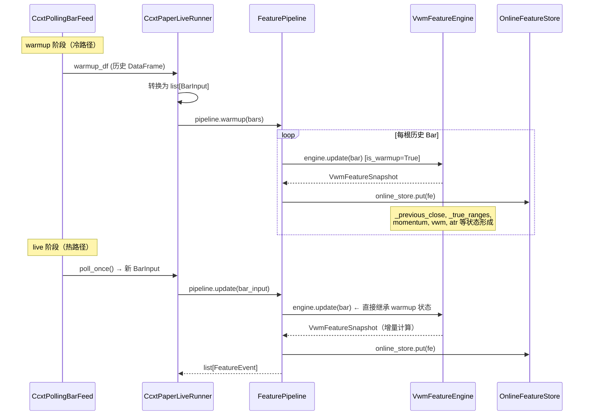
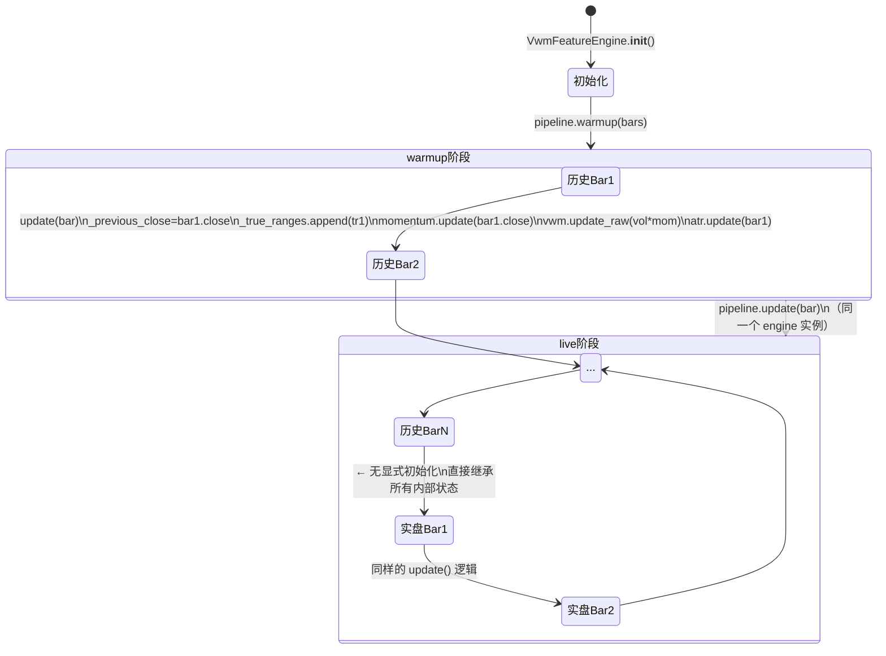
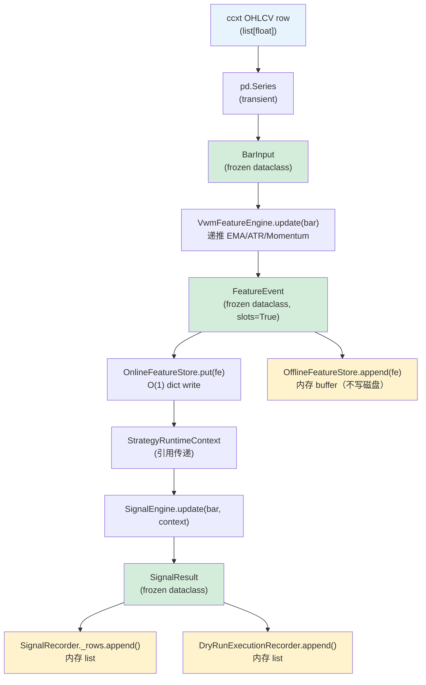
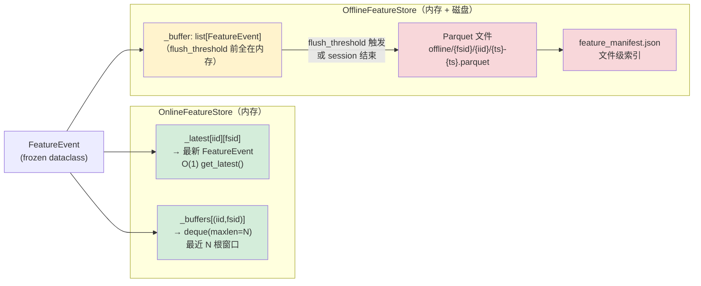
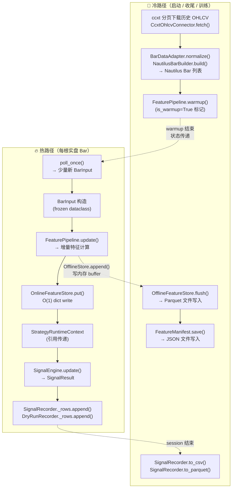

# 热路径与 Warmup/Live 拼接机制详解

> 基于 `nautilus_ext` 实际代码审计，2026-06-04

---

## 文件审计结论

| 文件 | 是否存在 | 关键类/函数 |
|---|---|---|
| `nautilus_ext/ccxt/ccxt_ohlcv_connector.py` | ✅ 存在 | `CcxtOhlcvConnector.fetch()` / `_paginate()` |
| `nautilus_ext/ccxt/ccxt_bar_mapper.py` | ✅ 存在 | `CcxtBarMapper.map()` / `_normalize()` |
| `nautilus_ext/ccxt/ccxt_cache.py` | ✅ 存在 | `CcxtCache` — 磁盘缓存辅助类 |
| `nautilus_ext/connectors/auto_bar_data_connector.py` | ✅ 存在 | `NautilusAutoBarDataConnector` |
| `nautilus_ext/adapters/bar_adapter.py` | ✅ 存在 | `BarDataAdapter.normalize()` |
| `nautilus_ext/builders/bar_builder.py` | ✅ 存在 | `NautilusBarBuilder.build()` |
| `nautilus_ext/ccxt_live/polling_bar_feed.py` | ✅ 存在 | `CcxtPollingBarFeed.warmup()` / `poll_once()` |
| `nautilus_ext/ccxt_live/paper_live_runner.py` | ✅ 存在 | `CcxtPaperLiveRunner.run()` / `_process_bar()` |
| `nautilus_ext/ccxt_live/signal_recorder.py` | ✅ 存在 | `SignalRecorder.append()` |
| `nautilus_ext/ccxt_live/dry_run_execution.py` | ✅ 存在 | `DryRunExecutionRecorder` |
| `nautilus_ext/features/feature_pipeline.py` | ✅ 存在 | `FeaturePipeline.warmup()` / `update()` |
| `nautilus_ext/features/vwm_features.py` | ✅ 存在 | `VwmFeatureEngine.update()` / `state_dict()` |
| `nautilus_ext/features/feature_event.py` | ✅ 存在 | `FeatureEvent` (frozen dataclass, slots=True) |
| `nautilus_ext/features/feature_store.py` | ✅ 存在 | `OnlineFeatureStore` / `OfflineFeatureStore` |
| `nautilus_ext/features/feature_manifest.py` | ✅ 存在 | `FeatureManifest.find_files()` |
| `nautilus_ext/strategies/vwm_short_signals.py` | ✅ 存在 | `VolumeWeightedMomentumShortSignalEngine` |
| `nautilus_ext/runners/backtest_runner.py` | ✅ 存在 | `NautilusBacktestRunner.run_strategy()` |
| `nautilus_ext/data_layer/market_event_store.py` | ❌ **当前未发现** | — |
| `nautilus_ext/data_layer/quant_data_layer.py` | ❌ **当前未发现** | — |

`nautilus_ext/data_layer/` 目录整体不存在。`MarketEventStore` 和 `QuantDataLayer` 均为 **planned（规划中）**，尚未实现。

---

## 一、历史数据与实盘数据的正确拼接方式

### 错误方式（不要这样做）

```python
# ❌ 错误：DataFrame concat + rolling 重新计算
full_df = pd.concat([historical_df, live_df])
full_df["momentum"] = full_df["close"].rolling(5).apply(...)
full_df["vwm_ema"]  = full_df["momentum"].ewm(...).mean()
```

问题：
- 每次来一根新 Bar，都要重新扫描全量历史；
- O(N) 计算，N 随时间线性增长；
- DataFrame 构造本身有 GC 压力；
- 训练集和实盘逻辑分离，容易不一致。

### 正确方式（当前实现）

```
历史 OHLCV rows (ccxt)
    │
    ▼  CcxtPollingBarFeed.warmup()
历史 DataFrame
    │
    ▼  CcxtPaperLiveRunner._warmup_signal_engine()
list[BarInput]  ──────────────────────────────────────────────┐
    │                                                          │
    ▼  FeaturePipeline.warmup(bars, is_warmup=True)           │
VwmFeatureEngine.update() × N 根                              │
    │  内部状态逐步形成                                        │
    │                                                          │
    ▼                                                          │
OnlineFeatureStore._latest[iid][fsid] = 最新快照              │
                                                               │
实盘 poll_once() 返回新 BarInput ◄─────────────────────────────┘
    │
    ▼  FeaturePipeline.update(bar_input)  ← 同一个 FeaturePipeline 实例
VwmFeatureEngine.update(bar)            ← 同一个 VwmFeatureEngine 实例
    │  直接读取 warmup 结束时的内部状态
    │  进行递推计算（增量更新，无历史回放）
    ▼
FeatureEvent (本根 Bar 的新特征)
```

**关键原则**：拼接点是 **FeatureEngine 的内部状态**，而不是 DataFrame 的行。

### 1.1 Mermaid：历史 warmup + live stitching 流



---

## 二、FeatureEngine 内部状态详解（以 VwmFeatureEngine 为例）

文件：`nautilus_ext/features/vwm_features.py`

### 2.1 维护的内部状态

| 字段 | 类型 | 含义 | warmup 后状态 |
|---|---|---|---|
| `current_bar` | `int` | Bar 计数器 | warmup 根数 |
| `_previous_close` | `float \| None` | 上一根 Bar 收盘价 | warmup 最后收盘价 |
| `_true_ranges` | `deque[float]` (maxlen=atr_len) | 最近 N 根真实波幅窗口 | 含最后 atr_len 根 warmup 的真实波幅 |
| `momentum` | `RawMomentumFeature` | mom_len 期动量特征对象 | 已初始化，保存内部 close 历史 |
| `vwm` | `EmaFeature` | avg_len 期 EMA 对象 | 已有收敛的 EMA 值 |
| `atr` | `AtrFeature` | atr_len 期 ATR 对象 | 已有收敛的 ATR 值 |
| `_latest_snapshot` | `VwmFeatureSnapshot \| None` | 最新快照（含 prev_vwm/prev_atr） | warmup 最后一根快照 |
| `last_ts_event` | `str \| None` | 最后处理事件的时间戳 | warmup 最后时间戳 |

### 2.2 live 第一根 Bar 如何读取 warmup 后状态

```python
# VwmFeatureEngine.update()  —  vwm_features.py:75
def update(self, bar: BarInput) -> VwmFeatureSnapshot:
    prev_vwm = self.vwm.value          # ← 直接读取 warmup 最后的 EMA 值
    prev_atr = self.atr.value          # ← 直接读取 warmup 最后的 ATR 值
    self.current_bar += 1              # ← 从 warmup 计数器继续递增

    self._true_ranges.append(self._true_range(bar))   # ← deque 继续滚动
    self._previous_close = bar.close   # ← 上一根收盘价（来自 warmup 最后一根）
    momentum = self.momentum.update(bar.close)  # ← RawMomentum 增量更新
    atr = self.atr.update(bar)         # ← AtrFeature 增量更新
    if momentum is not None:
        self.vwm.update_raw(bar.volume * momentum)  # ← EMA 增量更新
    ...
```

live 第一根 Bar 进来时：
- `prev_vwm` 和 `prev_atr` 直接来自 warmup 结束时的 EMA/ATR 值；
- `_true_range(bar)` 用 `self._previous_close`（即 warmup 最后收盘价）计算真实波幅；
- `momentum.update()` 在 mom_len 期的历史 closes 窗口上继续滚动；
- 整个计算路径对 "是 warmup 还是 live" 完全透明——同一行代码，同一个对象。

### 2.3 Mermaid：FeatureEngine 内部状态更新图



---

## 三、热路径的定义与实现

### 3.1 定义

**热路径（Hot Path）**：实盘每来一根新 Bar/Tick，必须在尽可能短的时间内完成的处理路径。

热路径的约束：
- 不允许构造 DataFrame；
- 不允许读取 Parquet 文件；
- 不允许写入 Parquet 文件；
- 不允许 rglob 扫描目录树；
- 不允许重新计算全部历史。

### 3.2 实盘单根 Bar 热路径

```
ccxt fetch_ohlcv() → list[list[float]]
        │
        │  CcxtPollingBarFeed._rows_to_df()
        ▼
pd.DataFrame（transient，只在 poll_once 内部存在）
        │
        │  去除 _seen_ts 中已见过的时间戳
        │  drop_incomplete_bar → 去除最后一根未完成 Bar
        ▼
新 Bar 的 pd.Series（poll_once() 返回）
        │
        │  CcxtPaperLiveRunner._process_bar()
        ▼
BarInput(open, high, low, close, volume, ts_event, instrument_id)
[frozen dataclass — 创建一次，不可变]
        │
        │  FeaturePipeline.update(bar_input)
        ▼
VwmFeatureEngine.update(bar) → VwmFeatureSnapshot
        │
        │  FeaturePipeline._process_event()
        ▼
FeatureEvent(ts_event, instrument_id, feature_set_id, values=...)
[frozen dataclass, slots=True — ~30% 更少内存]
        │
        ├──► OnlineFeatureStore.put(fe)
        │    [_latest[iid][fsid] = fe  ← O(1) dict 写入]
        │    [_buffers[(iid,fsid)].append(fe) ← deque 追加]
        │
        ▼
StrategyRuntimeContext(event=bar, features={fsid: fe}, position=...)
[dataclass — 引用传递，无数据复制]
        │
        │  VolumeWeightedMomentumShortSignalEngine.update(bar, context)
        ▼
SignalResult(entry_side, exit_side, reason, debug=...)
[frozen dataclass]
        │
        ├──► SignalRecorder._rows.append(dict)
        │    [in-memory list，不写磁盘]
        │
        └──► DryRunExecutionRecorder.append(row, result)
             [in-memory list，不写磁盘]
```

### 3.3 Mermaid：单根 live Bar 热路径



---

## 四、单根 Bar 格式转换次数

### 4.1 格式转换表

| 步骤 | 输入格式 | 输出格式 | 是否重型转换 | 路径 | 实现文件 |
|---|---|---|---|---|---|
| 1 | ccxt `list[float]` (OHLCV row) | `pd.DataFrame` row → `pd.Series` | 轻度（多行批量操作，只在 poll_once 内部）| 热路径前置 | `polling_bar_feed.py:_rows_to_df()` |
| 2 | `pd.Series` | `BarInput` (frozen dataclass) | 轻（逐字段赋值 6 个 float + int + str）| **热路径** | `paper_live_runner.py:_process_bar()` |
| 3 | `BarInput` | `VwmFeatureSnapshot` → `FeatureEvent` | 轻（递推计算 + dataclass 构造）| **热路径** | `vwm_features.py:update()` / `feature_pipeline.py:_process_event()` |
| 4 | `FeatureEvent` | `OnlineFeatureStore` 内部 dict 引用 | 极轻（O(1) dict 赋值）| **热路径** | `feature_store.py:OnlineFeatureStore.put()` |
| 5 | `OnlineFeatureStore` 引用 | `StrategyRuntimeContext.features` dict | 极轻（引用传递，无数据复制）| **热路径** | `paper_live_runner.py:_process_bar()` |
| 6 | `StrategyRuntimeContext` + `BarInput` | `SignalResult` (frozen dataclass) | 轻（纯逻辑计算）| **热路径** | `vwm_short_signals.py:update()` |
| 7 | `SignalResult` | `dict` row（SignalRecorder） | 轻（dict 字面量赋值）| **热路径** | `signal_recorder.py:append()` |
| 8 | `list[FeatureEvent]` buffer | `pd.DataFrame` → Arrow → Parquet | **重型**（仅在 flush 时批量执行）| **冷路径** | `feature_store.py:OfflineFeatureStore.flush()` |

### 4.2 关键结论

- **步骤 1–7 是热路径**：每根 Bar 必须执行，全部为轻量操作（dataclass 构造、dict 赋值、float 算术）。
- **步骤 8 是冷路径**：`OfflineFeatureStore.flush()` 在 `flush_threshold` 达到时才批量执行，或在 session 结束时由 `paper_live_runner._save_outputs()` 触发。
- 热路径中没有任何 `pd.DataFrame()` 构造、`pd.read_parquet()`、`glob`、`rglob` 调用。

---

## 五、对象如何加载、传递、缓存、落盘

### 5.1 Warmup 阶段（冷路径）

```python
# 1. CcxtPollingBarFeed.warmup() — polling_bar_feed.py:112
#    从交易所批量下载历史 OHLCV，返回 DataFrame
warmup_df = feed.warmup()  # → pd.DataFrame，加载到内存

# 2. CcxtPaperLiveRunner._warmup_signal_engine() — paper_live_runner.py:184
#    逐行转为 BarInput 列表（全部在内存中）
warmup_bars = [BarInput(...) for _, row in warmup_df.iterrows()]

# 3. 先通过 FeaturePipeline 预热特征引擎
pipeline.warmup(warmup_bars)  # 内部 warmup_mode=True → is_warmup=True 标记

# 4. 再通过信号引擎预热（Mode A）
for bar_input in warmup_bars:
    signal_engine.update(bar_input, position=..., bars_since_entry=...)

# 结果：
# - VwmFeatureEngine 内部状态已形成（_previous_close, EMA, ATR, momentum）
# - OnlineFeatureStore._latest[iid][fsid] 已有最新快照（is_warmup=True）
# - OnlineFeatureStore._buffers[(iid,fsid)] deque 已满载 warmup 特征事件
# - 不触发交易信号（warmup 阶段信号结果不进入 recorder）
```

### 5.2 Live 阶段（热路径主循环）

```python
# CcxtPaperLiveRunner.run() — paper_live_runner.py:141
while True:
    new_df = feed.poll_once()          # 只返回新 Bar（seen_ts 去重）
    for _, row in new_df.iterrows():
        _process_bar(row)              # 热路径：bar → feature → signal → record
    time.sleep(config.poll_interval_seconds)
```

每根新 Bar：
1. 转为 `BarInput`（6 个 float + 1 int + 1 str）；
2. 进入 `FeaturePipeline.update()` → 增量计算特征；
3. `OnlineFeatureStore.put(fe)` → O(1) 更新；
4. 构造 `StrategyRuntimeContext` → 传给信号引擎；
5. `signal_engine.update()` → `SignalResult`；
6. `SignalRecorder._rows.append()` → 内存。

### 5.3 Backtest 阶段

```python
# NautilusBacktestRunner.run_strategy() — backtest_runner.py:41
bars = data_connector.prepare_data()  # 从文件加载全量 Nautilus Bar 对象

# 可选：离线特征生成
if feature_pipeline:
    bar_inputs = [BarInput(open=float(b.open), ..., ts_event=int(b.ts_event)//1_000_000) for b in bars]
    feature_pipeline.update_many(bar_inputs)  # 批量处理，不区分 warmup/live
    feature_pipeline.flush()                  # 写 Parquet

# BacktestEngine 路径：Nautilus DataEngine 事件循环（不经过 FeaturePipeline）
engine = NautilusEngineRunner(...).run(instrument, bars, strategy)
```

注意：`backtest_runner.py` 注释明确说明：
> "This is the offline feature generation path; it does NOT integrate with the Nautilus DataEngine event loop (reserved for future work)."

即 Backtest 中的特征生成是**离线批量**的，不是 DataEngine 逐事件驱动的（这是 planned 功能）。

### 5.4 Mermaid：Online/Offline 缓存和落盘



### 5.5 旧特征的生命周期

- **被 `_latest` 替换**：每次 `put()` 直接覆盖，旧引用由 GC 回收；
- **仍在 `_buffers` deque**：窗口期内可被 `get_window()` 读取；deque 满后自动丢弃最旧的；
- **仍在 `_buffer` list**：flush 前仍在内存；
- **flush 后进入 Parquet**：由 `FeatureManifest` 记录文件路径和时间范围。

---

## 六、热路径 vs 冷路径

### 6.1 分类表

| 步骤 | 属于哪类路径 | 原因 |
|---|---|---|
| `poll_once()` 网络请求 | 热路径触发点 | 每 N 秒一次，时延来自网络 |
| `_rows_to_df()` 构建临时 DataFrame | 热路径前置（不可避免） | 仅为 poll 结果批量去重，数据量极小（通常 1–5 行）|
| BarInput 构造 | **热路径** | 6 个 float 赋值 |
| `FeaturePipeline.update()` | **热路径** | 无 DataFrame，纯递推计算 |
| `OnlineFeatureStore.put()` | **热路径** | O(1) dict 写 |
| `StrategyRuntimeContext` 构造 | **热路径** | 引用传递 |
| `SignalEngine.update()` | **热路径** | 纯逻辑，无 I/O |
| `SignalRecorder.append()` | **热路径** | dict 追加到 list |
| `DryRunExecutionRecorder.append()` | **热路径** | dict 追加到 list |
| `OfflineFeatureStore.flush()` | **冷路径** | 批量写 Parquet，有文件 I/O |
| `SignalRecorder.to_csv()` | **冷路径** | session 结束后写磁盘 |
| `FeatureManifest.save()` | **冷路径** | 仅在 flush 时写 JSON |
| `CcxtOhlcvConnector.fetch()` (warmup) | **冷路径** | 只在 session 开始时执行一次 |
| `NautilusBarBuilder.build()` (backtest) | **冷路径** | `BarDataWrangler.process()` 较重 |
| `OfflineFeatureStore.query()` (训练读取) | **冷路径** | 读 Parquet，有 I/O |

### 6.2 Mermaid：热路径 vs 冷路径全景



---

## 七、每一步由哪个文件实现

### 7.1 warmup 阶段文件映射

| 步骤 | 实现文件 | 关键函数/方法 |
|---|---|---|
| 1. 连接交易所，建立 Instrument | `ccxt_live/polling_bar_feed.py` | `CcxtPollingBarFeed.initialize()` |
| 2. 历史 OHLCV 下载（分页） | `ccxt/ccxt_ohlcv_connector.py` | `CcxtOhlcvConnector.fetch()` / `_paginate()` |
| 3. seen_ts 注册（防重复投送） | `ccxt_live/polling_bar_feed.py` | `CcxtPollingBarFeed.warmup()` |
| 4. DataFrame → list[BarInput] | `ccxt_live/paper_live_runner.py` | `_warmup_signal_engine()` |
| 5. FeaturePipeline warmup | `features/feature_pipeline.py` | `FeaturePipeline.warmup()` |
| 6. 特征引擎状态初始化 | `features/vwm_features.py` | `VwmFeatureEngine.update()` |
| 7. OnlineStore warmup 快照更新 | `features/feature_store.py` | `OnlineFeatureStore.put()` |
| 8. SignalEngine warmup | `ccxt_live/paper_live_runner.py` | `_warmup_signal_engine()` → `signal_engine.update()` |

### 7.2 live 热路径文件映射

| 步骤 | 实现文件 | 关键函数/方法 |
|---|---|---|
| 1. REST 轮询新 Bar | `ccxt_live/polling_bar_feed.py` | `CcxtPollingBarFeed.poll_once()` |
| 2. seen_ts 去重 + 不完整 Bar 过滤 | `ccxt_live/polling_bar_feed.py` | `poll_once()` |
| 3. Series → BarInput | `ccxt_live/paper_live_runner.py` | `_process_bar()` |
| 4. 特征递推计算 | `features/feature_pipeline.py` | `FeaturePipeline.update()` |
| 5. VwmFeature 增量更新 | `features/vwm_features.py` | `VwmFeatureEngine.update()` |
| 6. FeatureEvent 构造 + is_warmup 标记 | `features/feature_pipeline.py` | `_process_event()` |
| 7. OnlineStore 更新 | `features/feature_store.py` | `OnlineFeatureStore.put()` |
| 8. OfflineStore buffer 写入 | `features/feature_store.py` | `OfflineFeatureStore.append()` |
| 9. StrategyRuntimeContext 构造 | `ccxt_live/paper_live_runner.py` | `_process_bar()` |
| 10. 信号引擎决策 | `strategies/vwm_short_signals.py` | `VolumeWeightedMomentumShortSignalEngine.update()` |
| 11. 信号记录（内存） | `ccxt_live/signal_recorder.py` | `SignalRecorder.append()` |
| 12. 订单意向记录（内存，无真实下单） | `ccxt_live/dry_run_execution.py` | `DryRunExecutionRecorder.append()` |

### 7.3 冷路径（收尾/落盘）文件映射

| 步骤 | 实现文件 | 关键函数/方法 |
|---|---|---|
| 特征 Parquet flush | `features/feature_store.py` | `OfflineFeatureStore.flush()` |
| 文件索引更新 | `features/feature_manifest.py` | `FeatureManifest.save()` |
| Schema 持久化 | `features/feature_store.py` | `OfflineFeatureStore.write_schema()` |
| 信号 CSV/Parquet 写入 | `ccxt_live/signal_recorder.py` | `SignalRecorder.to_csv()` / `to_parquet()` |
| 订单意向 CSV 写入 | `ccxt_live/dry_run_execution.py` | `DryRunExecutionRecorder.to_csv()` |
| run_info.json 写入 | `ccxt_live/paper_live_runner.py` | `_save_outputs()` |

---

## 八、MarketEventStore / QuantDataLayer 现状

两个组件**当前均未实现**：

```
nautilus_ext/data_layer/  ← 目录不存在
```

### 8.1 MarketEventStore（planned）

预期职责：统一存储原始市场事件（Bar、Trade、Quote），使 FeaturePipeline 可以从本地重放，无需每次从 ccxt 下载。

当前状态：FeaturePipeline 直接消费由 ccxt 下载的 DataFrame 转换来的 BarInput 列表，或由 `NautilusAutoBarDataConnector` 从本地文件加载的 Nautilus Bar 对象（再手工转换为 BarInput）。

### 8.2 QuantDataLayer（planned）

预期职责：统一的数据查询层，同时支持原始市场数据和特征数据的联合查询，服务训练和推理。

当前状态：
- 特征数据通过 `OfflineFeatureStore.query()` + `FeatureManifest.find_files()` 访问；
- 原始市场数据通过 `CcxtOhlcvConnector` 或 `NautilusAutoBarDataConnector` 直接加载；
- 两者未统一。

---

## 九、提速策略与实现文件

| 提速策略 | 解决的问题 | 实现文件 |
|---|---|---|
| **1. warmup/live 共用同一 FeatureEngine 实例** | 消除了 DataFrame 拼接 + rolling 重算 O(N) 开销 | `feature_pipeline.py:FeaturePipeline` / `paper_live_runner.py:_warmup_signal_engine()` |
| **2. 递推状态内部保存（EMA/ATR/Momentum）** | 每根 Bar 增量更新 O(1)，不扫全量历史 | `vwm_features.py:VwmFeatureEngine` + `nautilus_indicators.py:EmaFeature/AtrFeature` |
| **3. 热路径全程无 DataFrame** | 避免 pandas 对象构造开销和 GC 压力 | `feature_pipeline.py:update()` / `feature_event.py:FeatureEvent(slots=True)` |
| **4. OnlineFeatureStore O(1) latest 查找** | 信号引擎读最新特征不需要遍历历史 | `feature_store.py:OnlineFeatureStore._latest` dict |
| **5. deque window 固定内存上限** | 防止历史特征事件无限累积耗尽内存 | `feature_store.py:OnlineFeatureStore._buffers` (deque maxlen) |
| **6. OfflineFeatureStore buffer + 批量 flush** | 避免每根 Bar 写一个小 Parquet 文件（I/O 放大） | `feature_store.py:OfflineFeatureStore.append()` / `flush()` |
| **7. FeatureManifest 文件级索引** | 查询时不 rglob 全目录，O(manifest 记录数) | `feature_manifest.py:FeatureManifest.find_files()` |
| **8. seen_ts set 去重** | 防止网络抖动导致同一 Bar 重复进入引擎 | `polling_bar_feed.py:CcxtPollingBarFeed._seen_ts` |
| **9. drop_incomplete_bar 过滤** | 防止正在写入的半根 Bar 污染计算结果 | `polling_bar_feed.py:poll_once()` / `ccxt_ohlcv_connector.py:fetch()` |
| **10. SignalEngine Mode B 从 context 读特征** | 多策略共享同一 FeaturePipeline，不重复计算 | `vwm_short_signals.py:VolumeWeightedMomentumShortSignalEngine.update()` / `features/interfaces.py:StrategyRuntimeContext` |

---

## 十、当前已实现 vs 规划中功能

### 已完整实现

| 功能 | 状态 |
|---|---|
| CcxtOhlcvConnector 分页下载 + 去重 + 不完整 Bar 过滤 | ✅ |
| CcxtPollingBarFeed warmup + poll_once + seen_ts 去重 | ✅ |
| FeaturePipeline.warmup() / update() 双模式 | ✅ |
| VwmFeatureEngine 递推计算 + state_dict checkpointing | ✅ |
| OnlineFeatureStore O(1) latest + deque window | ✅ |
| OfflineFeatureStore buffer + batch flush | ✅ |
| FeatureManifest JSON 索引 + find_files() | ✅ |
| StrategyRuntimeContext (Mode B 接口) | ✅ |
| SignalRecorder + DryRunExecutionRecorder (内存 + 导出) | ✅ |
| CcxtPaperLiveRunner 热路径主循环 | ✅ |
| NautilusBacktestRunner 离线特征生成路径 | ✅ |

### 规划中（Planned）

| 功能 | 当前状态 |
|---|---|
| `MarketEventStore` 统一原始市场事件存储 | ❌ 目录未创建 |
| `QuantDataLayer` 统一数据查询层 | ❌ 目录未创建 |
| Nautilus DataEngine 逐事件特征更新（Backtest 集成） | ❌ 明确注释为 future work |
| TradingNode 集成（真实实盘架构） | ❌ 仅有 paper live 和 backtest |
| FeatureCheckpointManager 热重启（自动加载 state_dict） | ❌ state_dict 接口存在，自动加载未实现 |
| Tick 级别特征引擎（TradeTickInput / QuoteTickInput） | ❌ 接口已定义，引擎未实现 |

---

## 附录：代码定位速查

| 需要查什么 | 去哪个文件看 | 关键行 |
|---|---|---|
| warmup → live 状态衔接 | `vwm_features.py:75` | `prev_vwm = self.vwm.value` |
| FeaturePipeline 打 is_warmup 标记 | `feature_pipeline.py:157` | `fe = replace(fe, is_warmup=True)` |
| OnlineStore O(1) put | `feature_store.py:88` | `self._latest[iid][fsid] = event` |
| OfflineStore flush 触发 Parquet 写 | `feature_store.py:243` | `OfflineFeatureStore.flush()` |
| 热路径无 DataFrame 约束 | `feature_event.py:22` | `slots=True` 注释 |
| Mode B context 读特征 | `vwm_short_signals.py:103` | `ext_vals = context.get_feature_values(...)` |
| seen_ts 去重防重放 | `polling_bar_feed.py:179` | `df = df[~df["timestamp_ms"].isin(self._seen_ts)]` |
| drop_incomplete_bar | `polling_bar_feed.py:183` | `df = df.iloc[:-1].copy()` |
| Backtest 离线特征生成（不接 DataEngine） | `backtest_runner.py:116` | `_run_feature_pipeline()` 注释 |
| MarketEventStore / QuantDataLayer | — | **当前未发现，整个 data_layer 目录不存在** |
